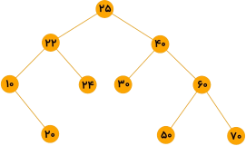
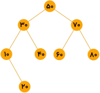

<div dir="rtl" align="right">


# 📚 درخت AVL Tree | AVL


<div align="center">
  
### AVL &nbsp;&nbsp;&rBarr;&nbsp;&nbsp; Adelson - Velsky and Landis

</div>

درخت **AVL**، یک درخت **BST متوازن و بالانس** است.

💡 درخت متوازن &nbsp;&nbsp;&lBarr;&nbsp;&nbsp; درختی که فاکتور توازن هر گره برابر **۱± یا صفر** باشد.

💡 فاکتور توازن &nbsp;&nbsp;&lBarr;&nbsp;&nbsp; تعداد سطوح زیردرخت چپ &minus; تعداد سطوح زیردرخت راست

در واقع اگر درخت BST متوازن باشد، به آن AVL می‌گویند.

⚠️ **توجه:** درخت BST در حالت کلی **متوازن نیست**.

در شکل زیر تعدادی درخت دودویی نشان داده شده‌اند که داخل هر نود، فاکتور توازن آن نوشته شده است. نودهایی که فاکتورشان ۲± است، توازن را به هم زده‌اند.

<div align="center">
  


</div>

<h3 id="custom-id-1">📌 نکته:</h3>

اگر $\large{N(h)}$ حداقل تعداد گره لازم برای ساخت AVL به ارتفاع $\large{h}$ باشد، آنگاه:  

* برای ساخت AVL به ارتفاع صفر، فقط یک نود لازم است. &nbsp;&nbsp;&xlArr;&nbsp;&nbsp; $\large{N(0) = 1}$
* برای ساخت AVL به ارتفاع یک، حداقل دو نود لازم است. &nbsp;&nbsp;&xlArr;&nbsp;&nbsp; $\large{N(1) = 2}$ 

<div align="center">
  
 &nbsp;&nbsp; یا &nbsp;&nbsp; 

</div>

* برای ساخت AVL به ارتفاع دو، حداقل چهار نود لازم است. &nbsp;&nbsp;&xlArr;&nbsp;&nbsp; $\large{N(2) = 4}$ 

<div align="center">
  


</div>

به طور کلی برای ساخت AVL به ارتفاع $\large{h}$ و با کمترین تعداد نود، کافی است سمت چپ ریشه تعداد $\large{N(h - 1)}$ و سمت راست ریشه تعداد $\large{N(h - 2)}$ نود قرار دهیم . پس:

<div align="center">
  
<h3 id="custom-id-2">

$\Large{N(h) = N(h - 1) + N(h - 2) + 1}$

</h3>

حداقل تعداد نودهای لازم برای ساخت **AVL** به ارتفاع $\large{h}$

</div>

برای مثال، برای ساخت AVL به ارتفاع سه، حداقل هفت نود لازم است. &nbsp;&nbsp;&xlArr;&nbsp;&nbsp; $\large{N(3) = N(2) + N(1) + 1 = 4 + 2 + 1 = 7}$

<div align="center">
  


</div>


می‌توان نتیجه گرفت که رشد تعداد گره‌ها نسبت به ارتفاع، به صورت زیر است:

<div dir="ltr" align="center">
  
```math
\Large{N(h) = \theta\left(\left(\frac{1 + \sqrt{5}}{2}\right) ^ h\right)}
```

</div>

این رابطه از حل معادلۀ بازگشتی فیبوناچی به دست می‌آید. بر همین اساس اگر بخواهیم ارتفاع ($\large{h}$) را برحسب تعداد نودها ($\large{N}$) بیان کنیم، خواهیم داشت:

<div dir="ltr" align="center">
  
```math
\Large{h = \theta\left(\log_{\frac{1 + \sqrt{5}}{2}}N(h)\right)}
```

</div>

این یعنی ارتفاع درخت AVL همواره از مرتبۀ **لگاریتمی** یا $\large{\theta(\log n)}$ باقی می‌ماند. به همین دلیل، تمام عملیات‌های پایه در این درخت با سرعت بسیار بالا و از مرتبۀ $\large{\mathcal{O}(\log n)}$ انجام می‌شوند:   

* جست‌وجو
* درج و حذف
* یافتن کمینه و بیشینه
* یافتن عنصر بعدی و قبلی

## 🛠 ساخت AVL
با تعدادی کلید، همانند ساخت درخت جستجوی دودویی، کلیدها را به ترتیب درج می‌کنیم. با هر عمل درج باید فاکتور توازن اجداد نود جدید را بررسی کنیم و اگر فاکتور توازن نودی ۲+ یا ۲- شده باشد، باید با عمل دوران، درخت را متوازن کنیم. با درج عنصر جدید $\large{z}$ ممکن است تعدادی از اجداد نود $\large{z}$، دارای فاکتور توازن ۲± شوند؛ که در این صورت باید به پایین‌ترین جد نود $\large{z}$، توجه کنیم. چهار حالت ممکن است پیش آید که با یک مثال نشان می‌دهیم و سپس حالات را بیان می‌کنیم. فرض کنید می‌خواهیم با کلیدهای ۱ و ۲ و ۳ و ترتیب‌های مختلف، AVL بسازیم. به چهار حالت زیر توجه کنید:

### 🧩 حالت اول
به ترتیب با ۱ و ۲ و ۳ (راست به چپ) AVL می‌سازیم.  
پس از درج عدد ۳، فاکتور توازن نود ۱ برابر ۲- شده و دوران $\large{LR(1)}$ انجام می‌شود.

<div align="center">
  


</div>

### 🧩 حالت دوم
به ترتیب با ۳ و ۲ و ۱ (راست به چپ) AVL می‌سازیم.  
پس از درج عدد ۱، فاکتور توازن نود ۳ برابر ۲+ شده و دوران $\large{RR(1)}$ انجام می‌شود.

<div align="center">
  


</div>

### 🧩 حالت سوم
به ترتیب با ۱ و ۳ و ۲ (راست به چپ) AVL می‌سازیم.  
ابتدا دوران $\large{RR(3)}$ و سپس دوران $\large{LR(1)}$ برای متوازن‌سازی انجام می‌شود.

<div align="center">
  


</div>

### 🧩 حالت چهارم
به ترتیب با ۳ و ۱ و ۲ (راست به چپ) AVL می‌سازیم.  
ابتدا دوران $\large{LR(1)}$ و سپس دوران $\large{RR(3)}$ برای متوازن‌سازی انجام می‌شود.

<div align="center">
  


</div>

حال به بررسی هر چهار حالت می‌پردازیم. منظور از $\large{z}$، نود جدید است. $\large{x}$ اولین جد $\large{z}$ است که فاکتور توازنش ۲+ یا ۲- شده است و $\large{y}$ فرزند $\large{x}$ است که  در مسیر درج واقع است.

**حالت اول**  
🔸 $\large{y}$ فرزند راست $\large{x}$ است.  
🔸 $\large{z}$ به زیردرخت راست $\large{y}$ درج شده است.  
🔸 فاکتور توازن $\large{x}$ برابر ۲- شده است.  
🔸 در این حالت کافیست $\large{x}$ را دوران به چپ ($\large{LR}$) بدهیم.   

**حالت دوم**  
🔸 $\large{y}$ فرزند چپ $\large{x}$ است.  
🔸 $\large{z}$ به زیردرخت چپ $\large{y}$ درج شده است.  
🔸 فاکتور توازن $\large{x}$ برابر ۲+ شده است.  
🔸 در این حالت کافیست $\large{x}$ را دوران به راست ($\large{RR}$) بدهیم.

**حالت سوم**  
🔸 $\large{y}$ فرزند راست $\large{x}$ است.  
🔸 $\large{z}$ به زیردرخت چپ $\large{y}$ درج شده است.  
🔸 فاکتور توازن $\large{x}$ برابر ۲- شده است.  
🔸 در این حالت، ابتدا $\large{y}$ را به راست و سپس $\large{x}$ را به چپ دوران می‌دهیم.

**حالت چهارم**  
🔸 $\large{y}$ فرزند چپ $\large{x}$ است.  
🔸 $\large{z}$ به زیردرخت راست $\large{y}$ درج شده است.  
🔸 فاکتور توازن $\large{x}$ برابر ۲+ شده است.  
🔸 در این حالت، ابتدا $\large{y}$ را به چپ و سپس $\large{x}$ را به راست دوران می‌دهیم.


## 📝 سوالات

---

**سوال ۱)** با کلیدهای داده شده (از چپ به راست) AVL بسازید.

<div dir="ltr" align="left">

۲۴, ۴۰, ۲۵, ۳۰, ۲۲, ۷۰, ۱۰, ۶۰, ۵۰, ۲۰

</div>

<details>
<summary>👀 پاسخ</summary>

<div align="left">

> 

</div>

</details>

---

**سوال ۲)** با کلیدهای ۱ و ۲ و ۳ و ۴ چه تعداد AVL شامل چهار نود با کلیدهای متمایز می‌توان ساخت؟

<details>
<summary>👀 پاسخ</summary>
چهار تا می‌توان ساخت. ✅

<div align="left">

>    

</div>

</details>

---

**سوال ۳)** در یک درخت AVL به ارتفاع ۴، لااقل چند گره وجود دارد؟

<div align="left">

(دولتی ۷۴)

</div>

گزینه ۱) ۷  
گزینه ۲) ۸  
گزینه ۳) ۱۰  
گزینه ۴) ۱۲

<details>
<summary>👀 پاسخ</summary>
گزینه ۱ ✅

[حداقل تعداد نودهای درخت AVL به ارتفاع h](#custom-id-1)
<div align="left">

>

</div>

</details>

---

**سوال ۴)** درخت AVL یک درخت دودوئی جستجو است که اختلاف  ارتفاع دو زیردرخت هر عنصر در آن حداکثر ۱ باشد. با عناصر ۱، ۲، ۳، ۴ و ۵ حداکثر چندتا درخت AVL می‌توان ساخت؟ (ارتفاع درخت تهی ۱- فرض می‌شود)

<div align="left">

(دولتی ۸۵)

</div>

گزینه ۱) ۵  
گزینه ۲) ۶  
گزینه ۳) ۷  
گزینه ۴) ۸

<details>
<summary>👀 پاسخ</summary>

گزینه ۲ ✅

</details>

---

**سوال ۵)** درخت AVL یک درخت دودویی است که ارتفاع دو زیردرخت هر گره آن حداکثر یک واحد با هم اختلاف دارد. (ارتفاع یک درخت تهی را ۱- فرض کنید). اگر $\large{T(h)}$ کمترین تعداد گره برای یک درخت AVL به ارتفاع $\large{h}$ باشد، کدام یک از روابط بازگشتی زیر برای $\large{T(h)}$ صحیح است؟

<div align="left">

(دولتی ۷۹)

**($\large{T(0) = 1}$ و $\large{T(1) = 1}$)**

<!-- 1. $\large{T(h) = 2T(h - 2) + 1}$  

2. $\large{T(h) = T(h - 1) + T(h - 2) + 1}$  

3. $\large{T(h) = 2T(h - 1) + 1}$  

4. $\large{T(h) = T\left(\Bigl\lfloor\frac{h}{2}\Bigr\rfloor\right) + T\left(\Bigl\lceil\frac{h}{2}\Bigr\rceil\right) + 1}$ -->

</div>

گزینه ۱) $\large{T(h) = 2T(h - 2) + 1}$

گزینه ۲) $\large{T(h) = T(h - 1) + T(h - 2) + 1}$

گزینه ۳) $\large{T(h) = 2T(h - 1) + 1}$

گزینه ۴) $\large{T(h) = T\left(\Bigl\lfloor\frac{h}{2}\Bigr\rfloor\right) + T\left(\Bigl\lceil\frac{h}{2}\Bigr\rceil\right) + 1}$

<details>
<summary>👀 پاسخ</summary>
گزینه ۲ ✅

> [رابطۀ بازگشتی حداقل تعداد نودهای درخت AVL به ارتفاع h](#custom-id-2)

</details>

---

**سوال ۶)** اگر به درخت AVL زیر کلید ۱۵ اضافه شود، کدام گزینه بخشی از پیمایش Preorder درخت حاصل خواهد بود؟

<div align="left">

(۹۰ IT)

</div>

<div align="center">



</div>

گزینه ۱) ۳۰ و ۴۰ و ۱۵ و ۱۰ و ۲۰  
گزینه ۲) ۴۰ و ۱۵ و ۲۰ و ۱۰ و ۳۰  
گزینه ۳) ۴۰ و ۲۰ و ۱۰ و ۱۵ و ۳۰  
گزینه ۴) ۴۰ و ۱۵ و ۱۰ و ۲۰ و ۳۰

<details>
<summary>👀 پاسخ</summary>
گزینه ۳ ✅

<div align="left">

> ۸۰ ۶۰ ۷۰ ***۴۰ ۲۰ ۱۰ ۱۵ ۳۰*** ۵۰ &nbsp;&nbsp;&rBarr;&nbsp;&nbsp; پیمایش Preorder درخت حاصل

</div>

</details>

---

## ✍️ تهیه‌کنندگان
- **زهرا چرخ‌کار** — گردآوری مطالب
- **مهدی ارجمندی** — پیاده‌سازی کدها و مطالب تکمیلی 
- **نصیر غفاری** — تدوین نهایی و قالب‌بندی Markdown 

</div>


