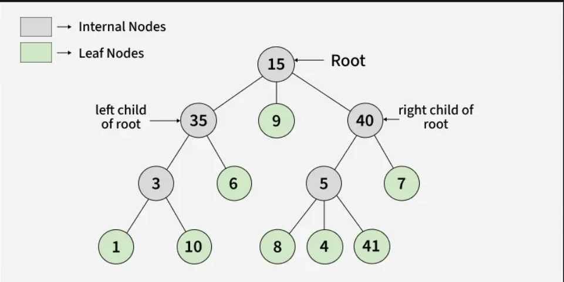
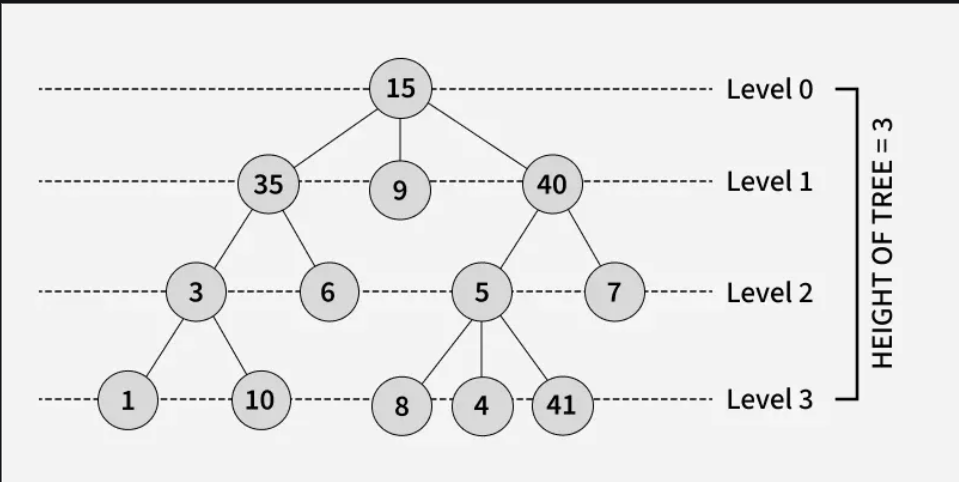

<br> 
<div dir="rtl" align="right">

## فهرست مطالب

- [فهرست مطالب](#فهرست-مطالب)
- [درخت و اجزای آن](#درخت-و-اجزای-آن)
- [درخت عمومی و درخت کامل](#درخت-عمومی-و-درخت-کامل)
- [نمونه کد](#نمونه-کد)
- [سوالات تستی](#سوالات-تستی)

<br>

# درخت و اجزای آن 
<br>

### 🌳درخت چیست؟

<p style="text-indent: 1.2em; text-align: justify;">
    در ساختمان داده، درخت‌ها (Trees) یکی از مهم‌ترین ساختارهای داده‌ی غیرخطی هستند که برای نمایش روابط سلسله‌مراتبی (hierarchical) استفاده می‌شوند. برخلاف آرایه یا لیست پیوندی که داده‌ها به‌صورت خطی پشت سر هم قرار می‌گیرند، درخت از مجموعه‌ای از گره‌ها (Nodes) تشکیل شده که هر گره می‌تواند به چند گره‌ی دیگر به نام فرزند (Child) متصل باشد و معمولاً تنها یک گره‌ی بالادستی به نام والد (Parent) دارد؛ به جز گره‌ی بالایی که به آن ریشه (Root) گفته می‌شود و والد ندارد. گره‌هایی که فرزندی ندارند برگ (Leaf) نامیده می‌شوند. درخت‌ها کاربردهای گسترده‌ای دارند؛ از نمایش ساختار فایل‌های سیستم‌عامل و ساختار DOM در صفحات وب گرفته تا پیاده‌سازی الگوریتم‌های جستجو و مرتب‌سازی. به‌طور کلی، درخت‌ها به دلیل انعطاف‌پذیری بالا و کارایی مناسب در عملیات جستجو، درج و حذف، نقش اساسی در طراحی الگوریتم‌ها و حل مسائل پیچیده‌ی داده‌ای ایفا می‌کنند. مفاهیمی مانند ارتفاع درخت، عمق گره، درجه‌ی گره و زیر‌درخت (Subtree) برای تحلیل ساختار آن به کار می‌روند، که در ادامه آن‌ها را به صورت مجزا توضیح می‌دهیم.

 </p>

 <hr style="width:60%;">

 ### اصطلاحات

<p style="text-indent: 1.2em; text-align: justify;">

#### والد:
گرهی است که به‌طور مستقیم یک یا چند گره دیگر را در سطح پایین‌تر هدایت می‌کند و نقش «والد» آن‌ها را دارد.

مثال: در درختی که 35 بالاتر از 3 و 6 است، 35 والد آن‌هاست.

#### فرزند:
گرهی است که مستقیماً زیر یک گره دیگر قرار دارد و از آن گره به ارث می‌رسد یا تابع آن است.

مثال: 3 و 6 فرزندان 35 هستند.

####  ریشه: 
گره بالایی در یک درخت که هیچ والدینی ندارد و نقطه شروع ساختار درخت است.

#### برگ(گره خارجی):
گره‌هایی که هیچ فرزندی ندارند و در انتهای شاخه‌ها قرار می‌گیرند.

#### گره داخلی:
گرهی که حداقل یک فرزند دارد و نقش واسطه بین ریشه و برگ‌ها را ایفا می‌کند.

#### جد:
گره‌هایی که در مسیر ریشه تا یک گره مشخص قرار دارند و نقش پیشینی آن گره را دارند.

#### نسل:
گره‌ای که تحت تأثیر یا زیرمجموعه یک گره دیگر قرار دارد، یعنی گره دیگر جد آن است.

#### خواهر برادر:
گره‌هایی که والد مشترک دارند و در یک سطح قرار گرفته‌اند.

#### زیر درخت:
گره‌ای به همراه تمام فرزندزاده‌هایش که یک بخش کامل از درخت را تشکیل می‌دهد و خود می‌تواند به عنوان یک درخت مستقل در نظر گرفته شود.

#### همسایه یک گره:
گره‌هایی که مستقیم به یک گره متصل هستند، شامل والد و فرزندان آن گره.


 </p>
 <p align="center">
 
</p>


</p>

<hr style="width:60%;">

 #### درجه:

<p style="text-indent: 1.2em; text-align: justify;">
درجهٔ درخت (Degree of a Tree) در ساختمان داده به بیشترین تعداد فرزندِ هر گره در آن درخت گفته می‌شود. به بیان دقیق‌تر، ابتدا «درجهٔ یک گره» را تعریف می‌کنیم که برابر است با تعداد فرزندان مستقیم آن گره؛ سپس درجهٔ کل درخت برابر است با بیشترین درجه در میان همهٔ گره‌های آن. مثلاً اگر در یک درخت، یک گره ۳ فرزند داشته باشد و بقیهٔ گره‌ها حداکثر ۲ فرزند داشته باشند، درجهٔ آن درخت برابر ۳ است. در درخت دودویی (Binary Tree) چون هر گره حداکثر می‌تواند ۲ فرزند داشته باشد، درجهٔ درخت حداکثر ۲ خواهد بود. همچنین درجه برگ های یک درخت صفر است.
 </p>

 <hr style="width:60%;">

 #### ارتفاع:

<p style="text-indent: 1.2em; text-align: justify;">
در ساختمان داده، ارتفاع (Height) درخت به طول بلندترین مسیر از ریشه تا یک گره برگ گفته می‌شود. به بیان دقیق‌تر، ارتفاع برابر است با تعداد یال‌ها (یا گاهی تعداد گره‌ها) در طولانی‌ترین مسیر از ریشه تا دورترین برگ. اگر ارتفاع را بر اساس تعداد یال‌ها حساب کنیم، درختی که فقط یک گره دارد ارتفاعش صفر است؛ اما اگر بر اساس تعداد گره‌ها حساب شود، ارتفاع آن یک در نظر گرفته می‌شود. ارتفاع نشان می‌دهد درخت چقدر «عمیق» است و اهمیت زیادی دارد، چون زمان اجرای بسیاری از عملیات‌ها مثل جستجو، درج و حذف در درخت‌ها به ارتفاع آن بستگی دارد.

 </p>


<hr style="width:60%;">

 #### سطح:

<p style="text-indent: 1.2em; text-align: justify;">
در ساختمان داده، سطح (Level) یک درخت به تعداد یال‌هایی گفته می‌شود که یک گره را از ریشه جدا می‌کند. به عبارت دیگر:

ریشه همیشه در سطح ۰ است.

فرزندان مستقیم ریشه در سطح ۱ هستند.

فرزندان آن‌ها در سطح ۲ و به همین ترتیب ادامه می‌یابد.

سطح یک درخت درصورتی که شمارش از عدد 1 باشد با ارتفاع آن به علاوه 1 برابر است.

مثلاً اگر یک درخت داشته باشیم که ریشه «A» است، و «B» و «C» فرزندان ریشه باشند، «B» و «C» در سطح ۱ هستند، و اگر «D» فرزند «B» باشد، «D» در سطح ۲ است.

این مفهوم کمک می‌کند تا عمق و ساختار سلسله‌مراتبی درخت را بهتر تحلیل کنیم.

 </p>
 <p align="center">
 
</p>


 
<hr style="width:60%;">


 #### عمق:

<p style="text-indent: 1.2em; text-align: justify;">
در ساختمان داده، عمق (Depth) یک گره در درخت به تعداد یال‌هایی گفته می‌شود که باید طی کنیم تا از ریشه به آن گره برسیم.

* معمولاً **ریشه** عمق ۰ دارد.
* فرزندان مستقیم ریشه عمق ۱ دارند، فرزندان آن‌ها عمق ۲ و به همین ترتیب ادامه می‌یابد.

مثلاً اگر ریشه «A» باشد، «B» فرزند «A» عمق ۱ و «C» فرزند «B» عمق ۲ دارد.

به‌طور خلاصه: **عمق گره = فاصله‌ی آن از ریشه**.

💡 نکته: گاهی عمق گره با سطح آن یکی در نظر گرفته می‌شود، اما در بعضی منابع «سطح» ممکن است از ۱ شروع شود، پس بهتر است همیشه مشخص شود که معیار از کجاست.

 </p>


 <hr style="width:70%;">


 #### درخت پُر

<p style="text-indent: 1.2em; text-align: justify;">
در ساختمان داده، درخت پر (Full Tree) یا درخت کامل از نوع پر به درختی گفته می‌شود که هر گره‌ی داخلی آن حتماً بیشینه‌ی تعداد فرزندهای ممکن را دارد. به زبان ساده:

اگر درخت دودویی (Binary Tree) باشد، هر گره‌ی داخلی حتماً دو فرزند دارد و هیچ گره داخلی تنها یک فرزند ندارد.

گره‌هایی که فرزند ندارند همان برگ‌ها (Leaf) هستند.

در این نوع درخت، گره‌های داخلی ناقص یا نیمه‌پر وجود ندارد.

💡 نکته: درخت پر با درخت کامل (Complete Tree) متفاوت است؛ درخت کامل لزوماً همه‌ی سطوح را پر می‌کند به جز آخرین سطح که از چپ به راست پر می‌شود، اما درخت پر فقط شرط داشتن بیشینه فرزند برای گره‌های داخلی را دارد.
 </p>


## درخت عمومی و درخت کامل
### درخت عمومی
<p style="text-indent: 1.2em; text-align: justify;">
در ساختمان داده، درخت عمومی (General Tree) نوعی ساختار داده غیرخطی است که در آن هر گره می‌تواند هر تعداد فرزند دلخواه داشته باشد و محدود به دو یا چند فرزند مشخص نیست، برخلاف درخت دودویی که هر گره حداکثر دو فرزند دارد. درخت عمومی از مجموعه‌ای از گره‌ها تشکیل شده است که یک گره بالایی به نام ریشه دارد و سایر گره‌ها به‌صورت سلسله‌مراتبی زیر آن قرار می‌گیرند. گره‌هایی که فرزند ندارند گره‌های برگ و گره‌هایی که حداقل یک فرزند دارند گره‌های داخلی نامیده می‌شوند. مفاهیمی مانند سطح، عمق، والد، فرزند، خواهر و برادر، زیردرخت، اجداد و فرزندزاده برای تحلیل ساختار و پیمایش درخت به کار می‌روند. درخت عمومی کاربردهای گسترده‌ای دارد، از جمله نمایش ساختار سازمانی، مدیریت فایل‌ها، پردازش XML و HTML و پیاده‌سازی الگوریتم‌های جستجو و مرتب‌سازی. این انعطاف‌پذیری باعث می‌شود در مسائل پیچیده‌ای که تعداد فرزندان از قبل مشخص نیست، درخت عمومی ابزار مناسبی باشد.
 </p>

<p align="center">
 
</p>


### درخت کامل
<p style="text-indent: 1.2em; text-align: justify;">
در ساختمان داده، درخت کامل (Complete Tree) نوعی درخت دودویی است که در آن همه سطوح به جز آخرین سطح به طور کامل پر شده‌اند و در آخرین سطح، گره‌ها به ترتیب از چپ به راست قرار می‌گیرند. به عبارت دیگر، هر گره در سطح قبل از آخرین سطح حتماً دو فرزند دارد و در آخرین سطح ممکن است بعضی از گره‌ها وجود نداشته باشند، اما فاصله‌ای خالی بین گره‌ها ایجاد نمی‌شود و گره‌ها همیشه از سمت چپ پر می‌شوند. این ویژگی باعث می‌شود که درخت کامل فشرده و متوازن باشد و عملیات‌هایی مانند درج و حذف یا جستجو در آن با کارایی بالایی انجام شوند. درخت کامل پایه و اساس ساختارهایی مانند Heap است و کاربرد گسترده‌ای در پیاده‌سازی صف‌های اولویت‌دار و الگوریتم‌های مرتب‌سازی دارد.
 </p>

## نمونه کد
درادامه تعدادی شبه کد پایتون برای کاربرد های مختلف در مبحث درخت رو خواهیم دید
### نمونه 1: ساخت یک درخت ساده
<div dir="ltr" align="left">

 ```python
class Node:
    def __init__(self, value):
        self.value = value
        self.children = []

root = Node(10)
root.children.append(Node(5))
root.children.append(Node(15))
 ```
</div>

&nbsp;
کاربرد: ذخیره داده‌ها به شکل سلسله‌مراتبی، جایی که هر گره می‌تواند چند فرزند داشته باشد.

 <hr style="width:85%;">

### نمونه 2: اضافه کردن فرزند به یک گره
<div dir="ltr" align="left">

 ```python
child = Node(7)
root.children[0].children.append(child)
 ```
</div>

&nbsp;
کاربرد: ایجاد شاخه‌های جدید در درخت و توسعه ساختار داده‌ای سلسله‌مراتبی.

 <hr style="width:85%;">


### نمونه 3: نمایش مقادیر گره‌ها به صورت ساده
<div dir="ltr" align="left">

 ```python
def print_tree(node, level=0):
    print("  " * level + str(node.value))
    for child in node.children:
        print_tree(child, level + 1)

print_tree(root)
 ```
</div>

&nbsp;
کاربرد: نمایش گرافیکی ساده‌ی درخت و ارتباط والد و فرزندها.

 <hr style="width:85%;">


### نمونه 4: شمارش تعداد گره ها
<div dir="ltr" align="left">

 ```python
def count_nodes(node):
    total = 1
    for child in node.children:
        total += count_nodes(child)
    return total

print(count_nodes(root))
 ```
</div>

&nbsp;
کاربرد: شمارش کل گره‌های درخت برای تحلیل اندازه و پیچیدگی ساختار داده.
</br>
</br>
</br>

## سوالات تستی
در این بخش چند نمونه از سوالات تستی مرتبط با مبحث را بررسی خواهیم کرد .

### ❓سوال1
کدام گزینه درباره گره برگ (Leaf Node) درست است؟

الف) گره‌ای که حداقل یک فرزند دارد.<br>
ب) گره‌ای که هیچ فرزندی ندارد.<br>
ج) گره‌ای که والد ندارد.<br>
د) گره‌ای که بیشترین تعداد فرزند را دارد.
<hr style="width:70%;">

### ❓سوال2
اگر گره‌ای در مسیر بین ریشه تا یک گره دیگر قرار داشته باشد (به جز خود آن گره)، چه نام دارد؟

الف) همسایه<br>
ب) خواهر برادر<br>
ج) جد<br>
د) برگ
<hr style="width:70%;">

### ❓سوال3
در یک درخت کامل کدام ویژگی درست است؟

الف) همه گره‌ها دقیقاً دو فرزند دارند.<br>
ب) همه سطوح کاملاً پر هستند بدون استثناء.<br>
ج) همه سطوح به جز آخرین سطح کاملاً پر هستند و سطح آخر از چپ پر می‌شود.<br>
د) فقط گره‌های برگ در سطح آخر قرار دارند.
<hr style="width:70%;">

### ❓سوال4
اگر تعداد یال‌های مسیر از ریشه تا یک گره برابر 3 باشد، سطح آن گره چند است؟

الف) 2<br>
ب) 3<br>
ج) 4<br>
د) بستگی به تعداد فرزندان دارد
<br><br><br>

## پاسخ‌نامه
### ✅  پاسخ صحیح سوال1: B 
(گره برگ در انتهای شاخه قرار دارد و هیچ فرزندی ندارد.)
### ✅  پاسخ صحیح سوال2: C 
(هر گره در مسیر ریشه تا یک گره مشخص، جد آن محسوب می‌شود.)
### ✅  پاسخ صحیح سوال3: C 
(این دقیقاً تعریف درخت کامل است.)
### ✅  پاسخ صحیح سوال4: B 
(سطح برابر تعداد یال‌ها از ریشه تا آن گره است و ریشه سطح 0 دارد.)

<br><br>

## نویسندگان
- مهدی انتشاری 
- عسل مهینی
- امیرضا فرسنگی
</div>