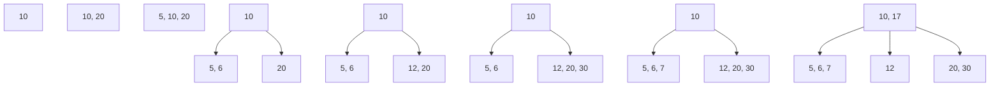
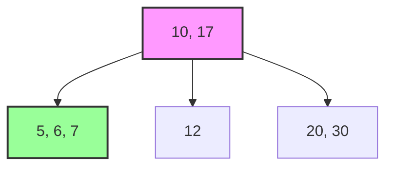
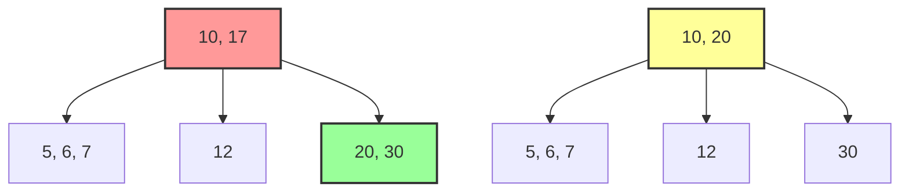

## 📘 درخت بی (B-Tree)


### 1️⃣ درسنامه

درخت بی (B-Tree) یک ساختار داده‌ای درختیِ خود-متوازن است که اجازه می‌دهد عملیات جستجو، دسترسی ترتیبی، درج و حذف در زمان لگاریتمی انجام شود. برخلاف درخت‌های جستجوی دودویی، در درخت بی هر Node یا گره می‌تواند بیش از دو فرزند (Child) داشته باشد.

یک درخت بی دارای $n$ کلید غیرنزولی و $n + 1$ اشاره‌گر است. برگ‌ها هم‌سطح هستند و اشاره‌گرهای آنها تعریف نشده است. اگر t را درجه‌ی درخت بنامیم برای B-Tree ویژگی‌های زیر تعریف می‌شود:

- هر نود بجز ریشه باید حداقل $t - 1$ کلید داشته باشد. ریشه می‌تواند حداقل یک کلید داشته باشد.
- هر نود حداکثر $2t - 1$ کلید دارد.


**💡 قضیه:** اگر تعداد کل کلیدها $n$ و ارتفاع `h` و درجه `t` باشد آنگاه:

$h \le \log_t \frac{n+1}{2}$

**✅ اثبات:** تعداد نودها وقتی مینیمم است که ریشه یک کلید و سایر نودها دارای $t - 1$ کلید باشند، در این صورت در عمق صفر یک نود، در عمق یک $2$ نود، در عمق دو $2t$ نود، در عمق سه $2t^2$ نود و ... در عمق h تعداد $2t^{h-1}$ نود وجود دارد پس برای تعداد n کلید داریم:


$$n \ge 1 + (t-1)\sum_{i=1}^{h} 2t^{i - 1} = 2t^{h} - 1 \Rightarrow  h \le \log_t \frac{n+1}{2}$$


> **نکته:** درخت بی تعمیم‌یافته‌ی درخت جستجوی دودویی (BST) است که به‌جای دو فرزند، چندین فرزند دارد.

> **نکته:** عملیات جستجو، درج و حذف در این درخت از مرتبه‌ی $\mathcal{O}(t.h) = \mathcal{O}(t.\log_t(n))$ است.

> **نکته:** برای درج در درخت بی، از ریشه جستجو می‌کنیم و در مسیر جستجو هر نودی که شامل `2t - 1` کلید بود (به عبارتی پر بود) آن را دو قسمت می‌کنیم و کلید وسط آن نود را به نود پدرش منتقل می‌کنیم، البته ممکن است ارتفاع درحت یک واحد افزایش یابد. در نهایت کلید جدید در یک برگ درج می‌شود.


### 2️⃣ عملیات اصلی

درخت B مانند هر ساختار جستجوی متوازن، مجموعه‌ای از عملیات بنیادی دارد که تضمین می‌کنند داده‌ها همواره مرتب، متوازن و قابل‌دسترسی در زمان لگاریتمی باقی بمانند. این عملیات شامل جستجو (Search) برای یافتن کلید، درج (Insertion) برای افزودن داده‌ی جدید با حفظ قیود ساختاری، و حذف (Deletion) برای حذف ایمن یک کلید همراه با بازمتعادل‌سازی درخت هستند. طراحی این الگوریتم‌ها به‌گونه‌ای است که ضمن حفظ ویژگی **حداقل نیمه‌پر بودن نودها**، ارتفاع درخت کنترل شده و هزینه‌ی دسترسی، چه در حافظه اصلی و چه در حافظه ثانویه، در مرتبه‌ی $\mathcal{O}(t.\log_t(n))$ باقی بماند.

#### 🔍 عملیات جستجو

جستجو در B-Tree بسیار شبیه به BST است، اما در هر نود به جای یک کلید، با لیستی از کلیدها مواجه می‌شویم. الگوریتم عملیات جستجو به شرح زیر است:

1.  **شروع از ریشه:** جستجو همیشه از نود ریشه آغاز می‌شود.
2.  **بررسی کلیدهای نود فعلی:** در نود جاری، کلیدها به‌صورت صعودی مرتب هستند. کلید موردنظر $k$ را کلیدهای نود مقایسه می‌کنیم تا اولین کلیدی را پیدا کنیم که:

```math
k \leq key_i
```

3.  **اگر کلید برابر بود:** اگر: $k = key_i$  آنگاه جستجو موفق است و عملیات پایان می‌یابد.
4. **اگر نود برگ باشد و کلید پیدا نشود:** در صورتی که نود برگ باشد و کلید برابر یافت نشود، یعنی عنصر در درخت وجود ندارد.
5. **انتخاب زیر‌درخت مناسب (در صورت داخلی بودن نود):** اگر نود داخلی باشد، بسته به نتیجه‌ی مقایسه، وارد یکی از فرزندان می‌شویم:
    - اگر `k < key[0]`: ورود به اولین فرزند
    - اگر بین `key[i]` و `key[i+1]` باشد: ورود به فرزند `i+1`
    - اگر بزرگ‌تر از آخرین کلید باشد: ورود به آخرین فرزند
6. **تکرار فرآیند تا رسیدن به نتیجه:** این مراحل در هر سطح تکرار می‌شوند تا کلید پیدا شود، یا به یک برگ برسیم و جستجو ناموفق شود.

#### 📥 عملیات درج

1. **شروع از ریشه:** درج از ریشه آغاز می‌شود و به‌صورت بالا به پایین ادامه پیدا می‌کند.
2. **بررسی پر بودن نود قبل از ورود**  اگر نود مقصد دارای `2t - 1` کلید باشد (پر باشد)، باید قبل از ورود، آن را بشکافیم یا اصطلاحا Split کنیم.
3. **شکافتن نود پر (Split):** هنگام Split، کلید میانی به نود والد منتقل می‌شود و نود پر به دو نود جدید تقسیم می‌شود؛ به‌طوری‌که نود چپ شامل $t - 1$ کلید اول و نود راست شامل $t - 1$ کلید آخر خواهد بود.
4. **انتخاب زیر‌درخت مناسب:** بعد از Split (در صورت نیاز)، بر اساس مقدار کلید جدید، وارد فرزند مناسب می‌شویم.
5. **درج در نود برگ غیرپر:** وقتی به یک برگ غیرپر برسیم، کلید جدید در محل مرتب خود درج می‌شود و ترتیب صعودی کلیدها حفظ می‌شود.
6. **افزایش ارتفاع در صورت Split شدن ریشه:** اگر ریشه دارای $2t - 1$ کلید باشد، ابتدا Split انجام می‌شود، سپس یک ریشه جدید ساخته می‌شود و ارتفاع درخت یک واحد افزایش می‌یابد.

#### 🗑️ عملیات حذف

1. **جستجوی کلید:** ابتدا کلید موردنظر را در درخت پیدا می‌کنیم.
2. **حذف از نود برگ (حالت ساده):** اگر کلید در یک برگ باشد، مستقیما حذف می‌شود. اگر تعداد کلیدها کمتر از $t - 1$ شود، باید بازمتعادل‌سازی انجام شود.
3. **حذف از نود داخلی:** اگر کلید در نود داخلی باشد، آن را با یکی از این دو جایگزین می‌کنیم: بزرگ‌ترین کلید زیر‌درخت چپ (Predecessor) یا کوچک‌ترین کلید زیر‌درخت راست (Successor). سپس آن کلید جایگزین را حذف می‌کنیم که در نهایت به حذف از برگ می‌رسد.
4. **بررسی Underflow (کمبود کلید):** اگر نود کمتر از $t - 1$ کلید داشته باشد، ابتدا بررسی می‌کنیم که آیا یکی از siblingها بیش از حداقل کلید دارد. در این صورت Redistribute انجام می‌شود، در غیر این صورت نود با یکی از siblingها Merge می‌شود.
5. **ادغام نودها (Merge):** نود با یکی از siblingها ادغام می‌شود و یک کلید از والد به نود ادغام‌شده منتقل می‌شود.
6. **کاهش ارتفاع در صورت خالی شدن ریشه:** اگر ریشه بدون کلید شود، تنها فرزند آن به ریشه جدید تبدیل می‌شود و ارتفاع درخت یک واحد کاهش می‌یابد.

### 3️⃣ مثال مفهومی

در این بخش، عملکرد B-Tree با یک مثال ساده نشان داده می‌شود. برای روشن بودن مثال، فرض می‌کنیم درخت بی با درجه حداقل $t = 2$ داریم. بنابراین هر نود غیر ریشه حداقل 1 کلید و حداکثر 3 کلید دارد. در ابتدا یک B-Tree خالی داریم.

#### 3.1 درج عناصر

اعداد زیر را در نظر بگیرید. عملیات درج را به ترتیب روی لیست زیر انجام می‌دهیم:

```
[10, 20, 5, 6, 12, 30, 7, 17]
```

1. **درج 10:** نود خالی است، پس نود ریشه حاوی [10] خواهد بود.
2. **درج 20:** نود ریشه [10] می‌شود [10, 20]. هنوز ظرفیت تکمیل نشده است.
3. **درج 5:** نود ریشه [10, 20] تبدیل به [5, 10, 20] می‌شود. ظرفیت نود پر نشده است.
4. **درج 6:** پس از درج، نود [5, 10, 20] پر می‌شود. کلید میانی 10 به ریشه منتقل می‌شود و نود تقسیم می‌شود.
5. **درج 12:** نود مناسب برای 12، نود [20] است. پس [12, 20] می‌شود.
6. **درج 30:** اضافه شدن 30 باعث می‌شود نود [12, 20] به [12, 20, 30] تبدیل شود.
7. **درج 7:** نود [5, 6] مناسب است و تبدیل به [5, 6, 7] می‌شود.
8. **درج 17:** نود [12, 20, 30] مناسب است و پس از اضافه شدن 17، نود پر شده [12, 17, 20, 30]. کلید میانی 17 به ریشه منتقل می‌شود.

در نهایت ساختار ‌B-Tree حاصل از این مثال مرحله به مرحله به شکل زیر است:



#### 3.2 جستجو

در جستجوی به دنبال عدد 7 می‌گردیم. مراحل جستجو به این صورت است:

1. عدد 7 را با ریشه یعنی `[10, 17]` مقایسه می‌کنیم. عدد 7 کمتر از 10 است بنابراین به فرزند چپ `[5, 6, 7]` می‌رویم.
2. عدد 7 در نود [5, 6, 7] یافت می‌شود. لذا جستجو با موفقیت به اتمام می‌رسد.

**نکته:** در یک BST نامتعادل، مسیر جستجو ممکن است طولانی باشد، اما B-Tree به دلیل تعادل دائمی، مسیر کوتاهی دارد.



#### 3.3 حذف

برای حذف عدد 17 را انتخاب می‌کنیم. عدد 17 در ریشه `[10, 17]` قرار دارد. در صورت حذف کلید داخلی، B-Tree جایگزین مناسب را از زیر درخت راست انتخاب می‌کند، در اینجا کوچک‌ترین کلید زیر درخت راست 20 است.



### 4️⃣ پیاده‌سازی کد

برای پیاده‌سازی کد B-Tree از زبان پایتون استفاده می‌کنیم تا پیاده‌سازی آن نیز راحت‌تر باشد. با کلیک بر روی [اینجا](./code/btree.py) یا مراجعه به مسیر 'codes/btree.py' کد را مشاهده کنید. در ادامه شرحی از بخش‌های مختلف کد را خواهید خواند.

1. **ساختار نودها:** در کد هر نود (BTreeNode) مانند یک محفظه است که می‌تواند چندین کلید را به صورت مرتب در خود جای دهد. متغیر degree یا $t$ تعیین‌کننده نظم درخت است؛ به این معنا که هر نود باید حداقل $t-1$ و حداکثر $2t-1$ کلید داشته باشد. این محدودیت باعث می‌شود که درخت همیشه پر و کم‌‌ارتفاع باقی بماند که سرعت دسترسی به داده‌ها را به شدت بالا می‌برد.

2. **شکافتن در درج (Split):** هنگام اضافه کردن یک کلید جدید، اگر کد با نودی مواجه شود که ظرفیتش تکمیل شده است، متد _split_child وارد عمل می‌شود. این متد نود پر شده را از وسط به دو نیم تقسیم کرده و کلید میانی را به نود والد می‌فرستد. این کار باعث می‌شود که درخت به جای رشد نامتقارن، به صورت عمودی و کاملا متوازن رشد کند.

3. **حفظ تعادل در حذف (Borrow & Merge):** سخت‌ترین بخش کد، مدیریت حذف کلیدهاست تا نودها بیش از حد خالی نمانند. اگر با حذف یک کلید، تعداد کلیدهای نود از حد مجاز کمتر شود، سیستم ابتدا سعی می‌کند از همسایه‌های چپ یا راست خود کلید قرض بگیرد (borrow). اگر همسایه‌ها نیز کلید اضافی نداشته باشند، دو نود مجاور با یکدیگر Merge می‌شوند تا ساختار یکپارچه درخت حفظ شود.

4. **پیمایش مرتب (In-order Traversal):** متد traverse به صورت بازگشتی تمام نودها را ملاقات می‌کند. عملکرد آن به این صورت است که ابتدا فرزند سمت چپِ یک کلید را بررسی می‌کند، سپس خود کلید را چاپ کرده و بعد به سراغ فرزند سمت راست می‌رود. این الگوریتم تضمین می‌کند که مهم نیست داده‌ها با چه ترتیبی وارد شده‌اند، خروجی نهایی همیشه یک لیست کاملا مرتب‌شده از کوچک به بزرگ خواهد بود.
