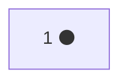
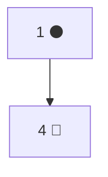
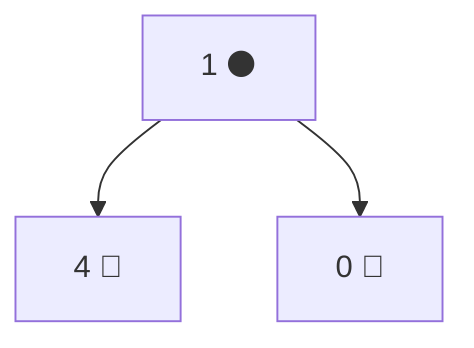
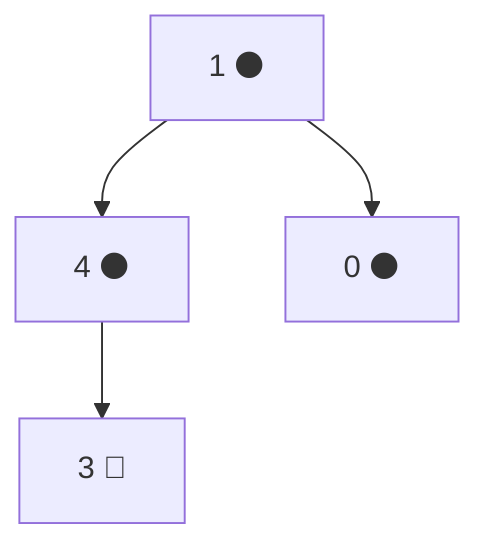
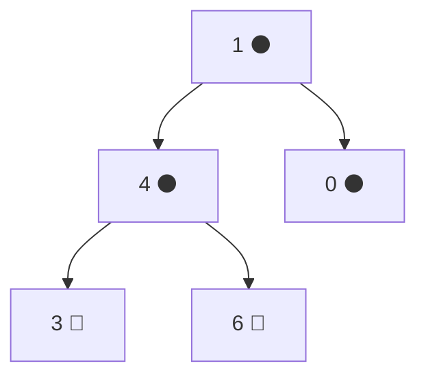

# 📚 درخت قرمز–سیاه (Red-Black Tree)

---

## 1️⃣ درسنامه

درخت قرمز–سیاه یک ساختمان داده از نوع درخت جستجوی دودوییِ خودمتعادل است. برای ذخیره و بازیابی سریع داده‌های مرتب استفاده می‌شود. هر گره در این درخت علاوه بر مقدار داده، یک بیت اضافی به نام «رنگ» دارد که می‌تواند قرمز یا سیاه باشد. این ویژگی باعث می‌شود درخت تقریباً متعادل باقی بماند.

پس از هر عملیات درج یا حذف، درخت با انجام چرخش در برخی از گره‌ها و تغییر رنگ آن‌ها بازآرایی می‌شود تا متعادل بماند. این قوانین تضمین می‌کنند که ارتفاع درخت در بدترین حالت در حد \(O(\log n)\) باقی بماند که در آن \(N\) تعداد گره‌ها است.

- جستجو، درج و حذف همگی در زمان \(O(\log n)\) انجام می‌شوند.
- برخلاف درخت جستجوی دودویی ساده که ممکن است در بدترین حالت به زمان \(O(n)\) برسد، درخت قرمز–سیاه پایدار و قابل پیش‌بینی است.
- برای ذخیره رنگ هر گره تنها یک بیت اضافی نیاز است، بنابراین مصرف حافظه آن تقریباً مشابه یک درخت جستجوی دودویی معمولی است.

---

## 2️⃣ 🌳 ویژگی‌های درخت قرمز–سیاه

- **گره:** هر گره یا 🔴 قرمز است یا ⚫ سیاه.
- **ریشه:** ریشه درخت همیشه ⚫ سیاه است.
- **گره قرمز:** هیچ گره قرمزی نمی‌تواند فرزند قرمز داشته باشد؛ یعنی دو گره قرمز نباید پشت سر هم قرار بگیرند.
- **گره‌های سیاه:** در تمام مسیرهای ممکن از یک گره تا برگ‌های زیرمجموعه‌اش، تعداد گره‌های سیاه باید یکسان باشد.
- **برگ‌ها:** تمام برگ‌ها (NIL) ⚫ سیاه در نظر گرفته می‌شوند.

---

## 3️⃣ 🔀 تفاوت با دیگر درخت‌ها

### 🔹 تفاوت با درخت دودویی جستجو (BST)

در بدترین حالت، ارتفاع درخت دودویی برابر \(N\) است،  
اما در درخت قرمز–سیاه، بدترین حالت ارتفاع \(O(\log N)\) است،  
که باعث می‌شود برای ذخیره‌سازی داده‌های مرتب بسیار کارآمدتر باشد.

پس از هر درج، درخت همچنان حداکثر ارتفاع \(O(\log N)\) را حفظ می‌کند.

> توجه: \(N\) تعداد گره‌ها است.

---

### 🔹 تفاوت با درخت AVL

درخت‌های AVL تعادل سخت‌گیرانه‌تری نسبت به درخت‌های قرمز–سیاه دارند، اما ممکن است هنگام درج و حذف نیاز به چرخش‌های بیشتری داشته باشند.

- برای برنامه‌هایی که درج و حذف مکرر انجام می‌شود، معمولاً درخت‌های قرمز–سیاه ترجیح داده می‌شوند.
- اگر جستجوها بیشتر باشند و درج یا حذف کمتر انجام شود، درخت‌های AVL معمولاً کارایی بهتری دارند.

---

## 4️⃣ ⚡ عملیات درخت قرمز–سیاه

### ✏️ ۴.۱ درج (Insertion)

درج یک گره جدید معمولاً در دو مرحله انجام می‌شود:

۱. درج مانند BST  
۲. اصلاح نقض قوانین درخت قرمز–سیاه

اگر والد گره جدید سیاه باشد، هیچ قانونی نقض نشده و نیازی به اصلاح نیست.  
اگر والد قرمز باشد، ممکن است قانون «عدم وجود دو قرمز پشت سر هم» نقض شود.

پس از درج گره جدید با رنگ 🔴 قرمز، چند حالت ممکن است رخ دهد:

**حالت ۱ (عمو قرمز است):**

- والد و عمو ⚫ سیاه می‌شوند.
- پدربزرگ 🔴 قرمز می‌شود.
- بررسی از سطح بالاتر ادامه می‌یابد.

**حالت ۲ (عمو سیاه است):**

- اگر گره جدید فرزند راست باشد → چرخش به چپ روی والد.
- اگر گره جدید فرزند چپ باشد → چرخش به راست روی پدربزرگ.
- سپس تنظیم رنگ‌ها انجام می‌شود.

---

### 🔍 ۴.۲ جستجو (Searching)

جستجو در درخت قرمز–سیاه مشابه BST است:

- از ریشه شروع می‌کنیم.
- اگر مقدار برابر باشد → گره پیدا شده است.
- اگر کمتر باشد → حرکت به شاخه چپ.
- اگر بیشتر باشد → حرکت به شاخه راست.
- تا رسیدن به گره موردنظر یا NIL ادامه می‌دهیم.

---

### ❌ ۴.۳ حذف (Deletion)

حذف نیز در دو مرحله انجام می‌شود:

۱. حذف مانند BST  
۲. اصلاح نقض قوانین

- اگر گره حذف‌شده ⚫ سیاه باشد، ممکن است وضعیت **Double-Black** ایجاد شود.

رفع Double-Black:

- اگر برادر 🔴 قرمز باشد:
  - چرخش روی والد.
  - اصلاح رنگ‌ها.

- اگر برادر ⚫ سیاه باشد:
  - اگر همه فرزندان برادر سیاه باشند:
    - تغییر رنگ برادر.
    - انتقال مشکل به سطح بالاتر.
  - اگر حداقل یکی از فرزندان برادر 🔴 قرمز باشد:
    - اگر فرزند دور قرمز باشد → چرخش و اصلاح رنگ.
    - اگر فرزند نزدیک قرمز باشد → ابتدا چرخش روی برادر، سپس اعمال حالت قبل.

این روش‌ها تضمین می‌کنند که ارتفاع درخت همچنان \(O(\log N)\) باقی بماند.

---

## 5️⃣ 🔄 چرخش‌ها (Rotations)

### ⬅️ چرخش به چپ در گره x

چرخش به چپ، درخت را به سمت چپ می‌چرخاند و فرزند راست x یعنی y را جایگزین x می‌کند.

مراحل:

۱. x.right = y.left  
۲. اگر y.left وجود داشته باشد → y.left.parent = x  
۳. y.parent = x.parent  
۴. اگر x ریشه باشد → ریشه = y  
۵. در غیر این صورت، پیوند والد به y متصل می‌شود.  
۶. y.left = x  
۷. x.parent = y

---

### ➡️ چرخش به راست در گره x

چرخش به راست، درخت را به سمت راست می‌چرخاند و فرزند چپ x یعنی y را جایگزین x می‌کند.

مراحل:

۱. x.left = y.right  
۲. اگر y.right وجود داشته باشد → y.right.parent = x  
۳. y.parent = x.parent  
۴. اگر x ریشه باشد → ریشه = y  
۵. در غیر این صورت، پیوند والد به y متصل می‌شود.  
۶. y.right = x  
۷. x.parent = y

---

## 6️⃣ ✅ مزایا

- در بدترین حالت، پیچیدگی زمانی عملیات‌ها \(O(\log n)\) است.
- قوانین درج و حذف ساختارمند و مشخص هستند.
- مناسب برای ساختارهای داده با عملکرد بالا.
- مصرف حافظه تقریباً مشابه BST است.

---

## 7️⃣ ⚠️ معایب

- نسبت به AVL قوانین درج و حذف پیچیده‌تر هستند.
- هنگام درج و حذف، سربار اصلاح ساختار وجود دارد.

---

## 8️⃣ 💻 کاربردها

- پیاده‌سازی `map` و `set` در ++C
- `TreeMap` در Java
- سیستم‌عامل‌ها (مانند Linux CFS)
- نگاشت حافظه مجازی
- صف‌های اولویت‌دار
- هرجا که دسترسی سریع به داده‌های مرتب نیاز باشد

---

---

## 9️⃣ 🧠 مثال مفهومی

در این مثال، اعداد زیر را به ترتیب درج می‌کنیم:

**1 → 4 → 0 → 3 → 6**

---

### 1️⃣ درج 1

گره جدید به صورت قرمز درج می‌شود،  
چون ریشه است به رنگ سیاه تغییر می‌کند.

---

### 2️⃣ درج 4

4 به عنوان فرزند راست 1 درج می‌شود (قرمز).  
والد سیاه است → نیازی به اصلاح نیست.

---

### 3️⃣ درج 0

0 به عنوان فرزند چپ 1 درج می‌شود (قرمز).  
والد سیاه است → ساختار معتبر است.

---

### 4️⃣ درج 3

3 به عنوان فرزند چپ 4 درج می‌شود (قرمز).

وضعیت:

- والد (4) قرمز
- عمو (0) قرمز

📌 حالت «عمو قرمز» → تغییر رنگ‌ها

- 4 و 0 سیاه می‌شوند
- 1 قرمز می‌شود
- چون 1 ریشه است دوباره سیاه می‌شود

---

### 5️⃣ درج 6

6 به عنوان فرزند راست 4 درج می‌شود (قرمز).  
والد (4) سیاه است → نیازی به اصلاح نیست.

---

### ✅ ساختار نهایی

- هیچ دو گره قرمز متوالی وجود ندارد
- تعداد گره‌های سیاه در تمام مسیرها برابر است
- ارتفاع در حد \(O(\log n)\) باقی مانده است

---

## 9️⃣ 📝 سوالات تمرینی

### 1️⃣ تفاوت درخت قرمز–سیاه با AVL چیست؟

در چه شرایطی استفاده از درخت AVL مناسب‌تر است و در چه شرایطی درخت قرمز–سیاه انتخاب بهتری است؟

---

### 2️⃣ کران ارتفاع درخت قرمز–سیاه

اثبات کنید ارتفاع یک درخت قرمز–سیاه با \( n \) گره داخلی حداکثر برابر است با:

\[
2 \log_2(n+1)
\]

---

### 3️⃣ کمینه تعداد گره‌ها با black-height مشخص

فرض کنید black-height یک درخت قرمز–سیاه برابر \( bh \) باشد.  
حداقل تعداد گره‌های داخلی ممکن را بر حسب \( bh \) به دست آورید و اثبات کنید.

---

### 4️⃣ چرا گره جدید در درج به رنگ قرمز قرار داده می‌شود؟

توضیح دهید اگر گره جدید را در ابتدا سیاه رنگ کنیم چه مشکلی در ویژگی‌های درخت ایجاد می‌شود.

---

### 5️⃣ تحلیل چرخش‌ها

در یک چرخش به چپ یا راست:

- چه تعداد اشاره‌گر تغییر می‌کند؟
- چرا چرخش خاصیت درخت جستجوی دودویی را نقض نمی‌کند؟

---

### 6️⃣ تحلیل حالت‌های حذف

در فرآیند حذف، اگر گره حذف‌شده سیاه باشد ممکن است وضعیت **Double-Black** ایجاد شود.

سه حالت زیر را توضیح دهید:

- وقتی برادر قرمز است
- وقتی برادر سیاه و هر دو فرزندش سیاه هستند
- وقتی برادر سیاه و حداقل یکی از فرزندانش قرمز است

---

