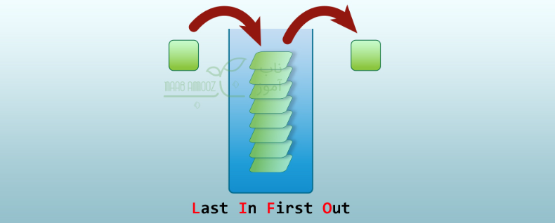
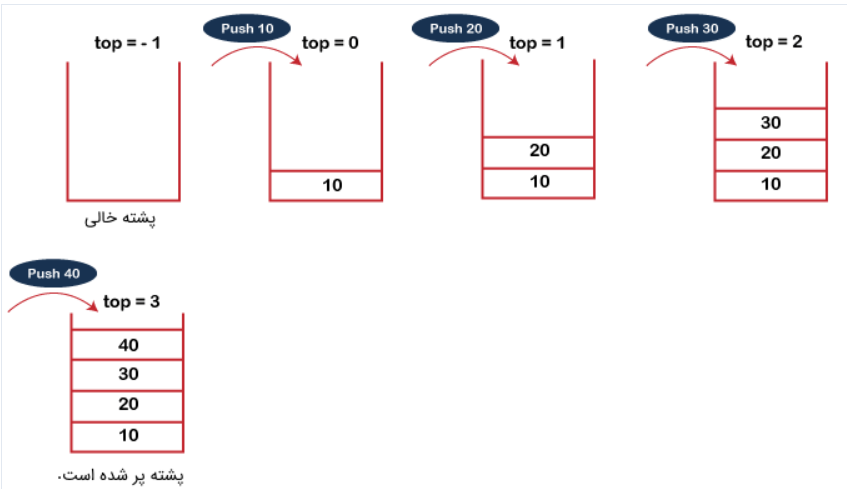
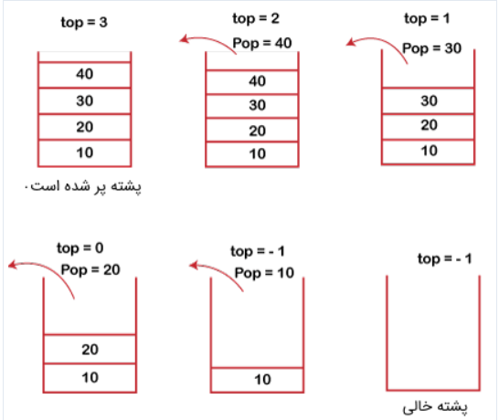
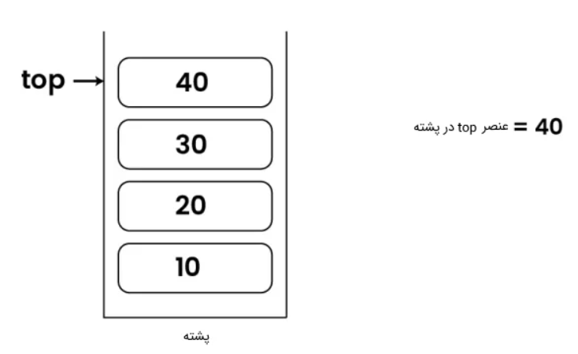
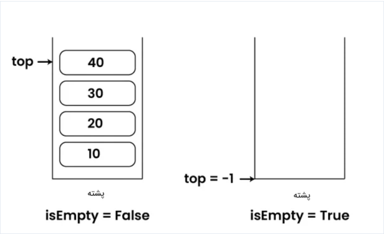
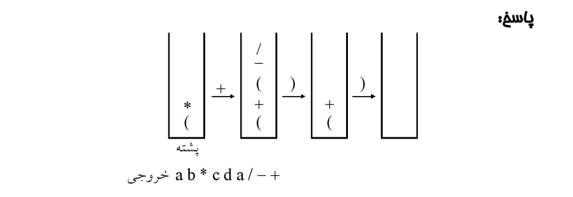
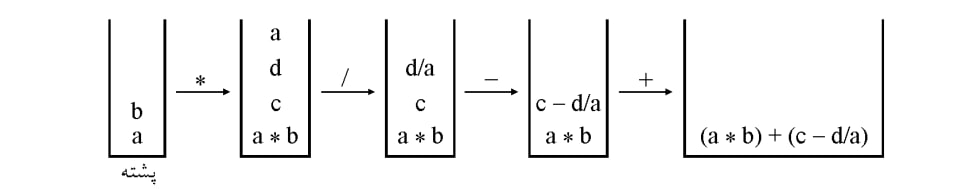
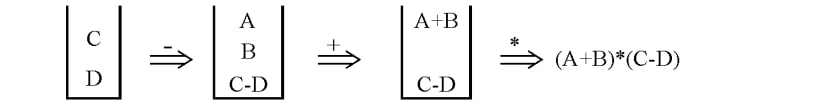

<style>
body {
    background-color: #e0d9c3ff;
}
</style>

<div dir="rtl">
<h2 style="color:#808000;">
 مقدمه 
</h2>

<h3 style="color:#A0522D;">
تعریف کلی پشته
</h3>

<h4 style="color:#000000;">
<div dir="rtl">
پشته (stack) ساختمان داده‌ای است که از لیست یا فهرست برای سازماندهی داده‌ها استفاده می‌کند و در عین حال از انتزاع نیز پشتیبانی می‌کند و یک نوع داده انتزاعی را فراهم می‌سازد. در پشته عمل اضافه کردن و حذف عنصر، فقط در یک طرف آن، بنام بالای پشته انجام می‌شود. یعنی عنصری که از همه دیرتر وارد پشته شد، از همه زودتر از پشته حذف می‌گردد. به‌همین دلیل گفته می‌شود که پشته از سیاست خروج به ترتیب عکس ورود (LIFO) پیروی می‌کند.


LIFO :


کوتاه‌شدهٔ عبارت Last In First Out (آخرین ورودی از همه زودتر خارج می‌شود) است. این سیاست اساس کار پشته‌ها را تشکیل می‌دهد و به مفهوم آن است که آخرین 
دادهٔ ذخیره شده در پشته، نخستین داده‌ای است که بازیابی می‌شود.پشته از ساختار ذخیره داده خطی استفاده می‌کند. 
</h4>

<h3 style="color:#A0522D;"> 
اهمیت پشته در ساختمان داده
</h3>

<h4 style="color:#000000;">

 پشته (Stack) یکی از مهم‌ترین و بنیادی‌ترین ساختارهای داده در علم کامپیوتر است و دلیل اهمیت بالای آن، نقش حیاتی‌اش در مدیریت جریان اجرای برنامه‌ها، پردازش داده‌ها و حل بسیاری از مسائل الگوریتمی است. اهمیت پشته را می‌توان در چند بخش توضیح داد:

۱. نقش  در اجرای برنامه‌ها (Call Stack)

یکی از اصلی‌ترین دلایل اهمیت پشته، استفادهٔ آن در اجرای توابع در همهٔ زبان‌های برنامه‌نویسی است.
هر بار تابعی صدا زده می‌شود:

 پارامترهای تابع
, آدرس بازگشت
, متغیرهای محلی
همگی در پشتهٔ فراخوانی‌ها ذخیره می‌شوند.

بدون ساختار پشته:

 اجرای بازگشتی ممکن نبود؛
 مدیریت بازگشت به خط قبلی غیرممکن می‌شد؛
پس پشته عملاً اجرای برنامه‌ها را ممکن می‌کند.

۲. مدیریت بازگشت (Recursion)

الگوریتم‌های بازگشتی بدون پشته عملاً قابل اجرا نیستند.
در هر فراخوانی بازگشتی:

وضعیت فعلی‌, مقدارهای محلی, مسیر حل
روی پشته ذخیره می‌شود و پس از برگشت مرحله‌به‌مرحله خارج می‌شود.
این دقیقاً رفتار LIFO است که recursion را امکان‌پذیر می‌کند.

۳. حل مسائل نحوی (Parsing)

در کامپایلرها و مفسرها، پشته اهمیت بسیار زیادی دارد:

بررسی توازن پرانتزها, تحلیل عبارات جبری مثل (infix، postfix), تبدیل عبارات اجرای ماشین‌های پشته‌ای (PDA)
تقریباً همهٔ parserها از پشته برای دنبال کردن ساختار نحوی استفاده می‌کنند.

۴. پیمایش گراف و درخت (DFS)

الگوریتم DFS (Depth-First Search) به صورت طبیعی با پشته کار می‌کند.
حتی اگر به صورت بازگشتی اجرا شود، عملاً پشتهٔ فراخوانی‌ها آن را مدیریت می‌کند.

این باعث می‌شود پشته در:

مسائل مسیر‌یابی, پیدا کردن اجزای همبند, حل پازل‌ها, Backtracking
نقش کلیدی داشته باشد.

۵. مدیریت حالت در Undo/Redo

در بسیاری از نرم‌افزارها مثل:

Word, Photoshop, IDE 

عملیات "بازگشت" (Undo) و "انجام مجدد" (Redo) با دو پشته مجزا انجام می‌شود.
این سازوکار ساده به‌طور گسترده در رابط‌های کاربری استفاده می‌شود.

۶. سادگی، سرعت و کارایی

پشته به دلیل:

پیاده‌سازی ساده, سرعت بالای عملیات O(1), عدم نیاز به جستجو یا پیمایش
یکی از سریع‌ترین ساختارهای ذخیره‌سازی موقت است و در الگوریتم‌ها کاربرد زیادی دارد.

۷. مدیریت مسیر در مرورگر و نرم‌افزارها

پشته برای ذخیرهٔ مسیرهای قبلی استفاده می‌شود.
مثلاً:

دکمهٔ Back/Forward در مرورگر, مسیریابی در فایل‌ منجرها این رفتار دقیقاً LIFO است.
</h4>


<h2 style="color:#808000;">
ویژگی‌ها و مشخصات پشته
</h2>

<h3 style="color:#A0522D;">
 ساختار LIFO (Last In First Out)
</h3>

<h4 style="color:#000000;">
ساختار LIFO یا Last In, First Out یکی از ساده‌ترین و 
درعین‌حال مهم‌ترین الگوهای ذخیره‌سازی داده است که در آن آخرین عنصری که وارد می‌شود، اولین عنصری است که خارج می‌شود.
به عبارت ساده:

هر چیزی که آخر گذاشتید، اول برداشته می‌شود.
این رفتار دقیقاً مشابه پشتهٔ ظرف‌ها، کتاب‌ها یا سینی‌هایی است که در زندگی واقعی با آن‌ها سر و کار داریم.


***مثال ساده از LIFO***

فرض کنیم این عناصر را به ترتیب وارد پشته کردیم:

```
Push 10  
Push 20  
Push 30
```
ساختار پشته:

```
Top →  30
       20
       10
```
اگر Pop انجام دهیم:

```
Pop → 30
```
و بعد از آن پشته به صورت زیر در میاد:

```
Top →  20
       10
```
می‌توان دید که اخرین ورودی موقع حذف کردن اول حذف می‌شود.



</h4>
<h3 style="color:#A0522D;">
مزایا و محدودیت‌های پشته (Stack)
</h3>

<h4 style="color:#000000;">

<h3 style="color:#FF8C00;">
مزایای پشته
</h3>

<h4 style="color:#000000;">

1.پیاده‌سازی ساده

پشته یکی از ساده‌ترین ساختارهای داده است و معمولاً تنها با:

یک اشاره‌گر (top), یک آرایه یا لیست  قابل پیاده‌سازی است.

2.عملیات بسیار سریع (O(1))

عملیات اصلی پشته:


- _Push_


- _pop_ 


- _peek_


همگی در زمان ثابت O(1) انجام می‌شوند.
این سرعت بالا باعث می‌شود پشته در سیستم‌های عملکرد حساس بسیار کاربردی باشد.

3.مدیریت کارآمد حافظه

پشته فقط با یک نقطهٔ دسترسی (بالا) کار می‌کند، و این باعث:

مدیریت ساده حافظه, عدم نیاز به حرکت در داده, کنترل بهتر ساختار
می‌شود.

4.مناسب برای مدیریت حالت‌ها (State Management)

در سناریوهایی که نیاز است به حالت قبلی برگردیم مانند:


- _Undo/Redo_ 

- _Backtracking_
<div dir="rtl">

- مدیریت مسیرها

پشته بهترین انتخاب است.

5.ضروری برای اجرای برنامه‌ها

پشته برای
 _Call Stack_,
مدیریت توابع,
ذخیره متغیرهای محلی,
اجرای بازگشتی (Recursion)
کاملاً ضروری است.
بدون پشته اجرای برنامه‌ها غیرممکن می‌شود.

6.مناسب برای تجزیه و تحلیل عبارات

در پردازش زبان‌های برنامه‌نویسی
بررسی توازن پرانتزها, ارزیابی عبارات (postfix,  prefix), 
تبدیل عبارات ریاضی
همه با پشته انجام می‌شود.

<h3 style="color:#FF8C00;">
محدودیت‌های پشته
</h3>

<h4 style="color:#000000;">

1.دسترسی محدود فقط به آخرین عنصر

در پشته فقط به عنصر بالایی (top) دسترسی داریم.
بنابراین:

دسترسی تصادفی (Random Access) ممکن نیست؛ نمی‌توان عناصر وسط یا پایین را مستقیماً خواند یا تغییر داد؛ این مورد یکی از بزرگ‌ترین محدودیت‌های پشته است.

2.عدم انعطاف‌پذیری در جستجو

در پشته:

جستجو دشوار است؛ برای یافتن یک عنصر باید همه‌چیز را pop کنیم؛ در نتیجه برای کاربردهایی که نیاز به جستجوی سریع دارند مناسب نیست.

3.احتمال Overflow و Underflow

اگر پشته با آرایه ثابت پیاده‌سازی شود:

<div dir="rtl">
__ Stack Overflow → وقتی پشته پر است
<div dir="rtl">
__ Stack Underflow → وقتی پشته خالی است و pop می‌زنیم

در برنامه‌نویسی و سیستم‌عامل این خطاها اهمیت زیادی دارند.

4.محدودیت در حجم (در Stack Memory)

در حافظهٔ سیستم:

پشته فضای محدود دارد؛ فضای زیادی نمی‌توان در آن اختصاص داد؛ توابع بازگشتی عمیق باعث Stack Overflow می‌شوند؛
به همین دلیل در recursion باید مراقب عمق فراخوانی بود.

5.فقط برای موارد LIFO مناسب است.

اگر نیاز برنامه:

__ FIFO

__ دسترسی به چند موقعیت

__ یا ساختار پیچیده‌تر باشد

 پشته انتخاب خوبی نیست.

6.مدیریت سخت برای داده‌های پیچیده

وقتی داده‌ها ساختارهای پیچیده دارند:

نگه‌داشتن آن‌ها در پشته دشوار؛ معمولاً نیاز به سازوکارهای اضافی وجود دارد.
</h4>

<h2 style="color:#808000;">
 عملیات‌ها در پشته
</h2>

<h4 style="color:#000000;">

عملیات های پشته در ساختمان داده ها: از آنجایی که عناصر پشته فقط از یک طرف (بالای پشته) قابل دستیابی‌اند. پس عملیات های متعددی را میتوان روی پشته انجام داد که چند عملیات زیر به‌عنوان عملیات اصلی پشته مطرح اند:

Push --> 

عنصری را به بالای پشته اضافه می‌کند.

Pop -->

عنصر بالای پشته را حذف می‌کند.


Peek --> 

برای بررسی وجود داشتن داده ای در بالاترین مکان پشته  بدون حذف کردن آن از پشته به کار برده می‌شود.

isEmpty -->

این عملیات وضعیت خالی بودن یا نبودن پشته را مشخص می‌کند.

isFull --> 

این عملیات وضعیت پر بودن یا نبودن پشته را مشخص می‌کند.

StackEmpty --> 

که خالی بودن پشته را تست می‌کند.

Clear  --> 

تمام عناصر پشته را حذف می‌کند.

Contains -->

مشخص می‌کند که عنصری در پشته وجود دارد یا خیر.

CopyTo --> 

محتویات پشته را در آرایه‌ای از نوع شی کپی می‌کند.

count --> 

مجموع کل تعداد عناصر قابل دسترسی در پشته را محاسبه و اعلام می‌کند.

change--> 

عنصر موجود در محل مشخص شده در پشته را تغییر می‌دهد.

display -->  

همه عناصر قابل دسترس درون پشته را در خروجی نمایش می‌دهد.

در ادامه چند مورد PUSH و POP و isEmpty و Peek را که به عنوان پرکاربردترین عملیات پشته‌ها شناخته می‌شوند، به صورت مفصل‌تری توضیح داده‌ایم.

<h3 style="color:#A0522D;">
عملیات PUSH
</h3>

<h4 style="color:#000000;">
عملیات PUSH برای وارد کردن عنصرها به پشته استفاده می‌شود. این یکی از اولین توابعی است که می‌توان در هر پشته‌ای بکار برد. هر بار اجرای عملیات PUSH شامل مراحل خاصی است که در پایین فهرست کرده‌ایم.


1.قبل از وارد کردن هر عنصر به پشته باید بررسی کنیم که آیا پشته پُر شده یا نه.

2.در حالی که پشته از قبل پُر شده است، اگر سعی کنیم عنصری را به آن وارد کنیم، حالت Overflow رخ خواهد داد.

3.وقتی که پشته‌ای را مقداردهی اولیه می‌کنیم‌، باید مقدار بالاترین خانه پشته را برابر با 1- قرار دهیم. این کار باعث می‌شود که به سادگی با مقایسه بالاترین خانه پشته با عدد 1- به خالی بودن یا نبودن پشته پی ببریم. 

4.زمانی که عنصر جدیدی به پشته PUSH یا به آن وارد شد، در ابتدا مقدار top به صورت top=top+1 افزایش پیدا می‌کند و سپس عنصر در جایگاه جدید مقدار top قرار می‌گیرد.

5.تا وقتی که به «بیشترین اندازه» (Max Size) پشته برسیم، می‌توان عناصر را در پشته وارد کرد.

6.در تصویر زیر نمایشی از مراحل بالا برای پرشدن پشته را می‌توان مشاهده کرد.



عملیات POP

عملیات POP برای حذف عناصر از پشته استفاده می‌شود. این عملیات نیز شامل مراحل خاص خود برای اجرا است که در ادامه فهرست کرده‌ایم.

1.قبل از حذف کردن هر عنصر از پشته باید خالی بودن یا نبودن پشته را بررسی کنیم.

2.اگر برای حذف کردن عنصری از پشته خالی تلاش کنیم حالت Underflow رخ می‌دهد.

3.اگر پشته خالی نباشد، در ابتدا به عنصری که در خانه top پشته قرار گرفته دسترسی پیدا می‌کنیم و
سپس بلافاصله بعد از انجام عملیات POP، از مقدار top یک واحد کم می‌شود top=top-1.

4.در تصویر نمایش داده شده پایین، می‌توان مراحل توصیف شده بالا را مشاهده کرد.



عملیات Top یا Peek

این دو عبارت به یک معنا هستند. تابع ( )peek برای برگرداندن مقدار درون خانه Top بدون حذف این مقدار از پشته استفاده می‌شود.

الگوریتم این عملیات به این صورت است که:

1.قبل از برگرداندن بالاترین عنصر درون پشته، خالی بودن پشته را بررسی می‌کنیم.

2.اگر پشته خالی باشد و عبارت top == -1 مقدار True را برگرداند، فقط کافی است که به سادگی عبارت Stack is empty را در خروجی نمایش دهیم.


3.در غیر این صورت، عنصری را که در index = top ذخیره شده به کاربر برمی‌گردانیم.



عملیات isEmpty

عملیات isEmpty برای بررسی خالی بودن یا نبودن پشته در ساختمان داده استفاده می‌شود. در صورت خالی بودن مقدار True و در غیر این صورت مقدار False را برمی‌گرداند.

الگوریتم این عملیات به این صورت است که:

1.در ابتدا مقدار خانه top را پشته بررسی می‌کنیم.

2.اگر عبارت مقایسه‌ای top == -1 بر قرار بود، بنابراین پشته خالی است و مقدار Trueرا به خروجی برمی‌گردانیم.

3.در غیر این صورت، پشته خالی نیست و مقدار False را باید به خروجی برگردانیم.


</h4>

<h2 style="color:#808000;">
 پیاده‌سازی پشته
</h2>

<h3 style="color:#A0522D;">
پیاده‌سازی پشته با آرایه (Array)
</h3>

<h4 style="color:#000000;">

<h4 style="color:#9B59B6;">
حالت اول) یک پشته:
</h4>
در پیاده‌سازی یک پشته با آرایه، عنصر بالای پشته (top) همان عنصر آخر آرایه است.

برای این کار، ابتدا یک متغیر به اسم top می‌سازیم تا آخرین اندیس پر آرایه را نگه دارد.
در ابتدا مقدار top را روی 1- تنظیم می‌کنیم که نشان دهنده خالی بودن پشته است.

برای push کردن، ابتدا باید چک کنیم که پشته پر نباشد (top == n) که در این‌صورت می‌توان عباراتی مانند Stack Over Flow را در خروجی نمایش داد؛
اما در غیر این‌صورت، ابتدا مقدار top را یک واحد افزایش می‌دهیم (top = top + 1) و سپس اندیس متناظر با top را در آرایه، برابر مقداری قرار می‌دهیم که قرار است در پشته push شود.

برای pop کردن، ابتدا چک می‌کنیم که پشته خالی نباشد (top != -1) که در این‌صورت می‌توان عباراتی مانند Stack Under Flow را در خروجی نمایش داد؛
اما در غیر این‌صورت ابتدا مقدار top را یک واحد کم می‌کنیم (top = top - 1) و سپس اندیس متناظر با top + 1 در آرایه را که همان عنصر pop شده است، برمی‌گردانیم.

<h4 style="color:#9B59B6;">
حالت دوم) پشته چندگانه:
</h4>
برای پیاده‌سازی دو پشته در یک آرایه، بهترین راه این است که دو متغیر top1 و top2 تعریف کنیم که در جهت عکس هم کار می‌کنند و هرکدام نشان دهنده بالای پشته متناظر با اندیس‌شان هستند.

فرضا S یک آرایه n عنصری باشد؛ S[0] ابتدای پشته اول و S[n - 1] ابتدای پشته دوم است.

شرط خالی بودن پشته اول:

top1 = -1

شرط خالی بودن پشته دوم:

top2 = n

شرط پر بودن آرایه (پر بودن هر دو پشته):

top2 = top1 + 1

البته روش فوق برای پیاده‌سازی بیش از ۲ پشته کارایی ندارد.

برای پیاده‌سازی m پشته در یک آرایه n عنصری، آرایه را به m بخش تقسیم می‌کنیم.
برای هر پشته i:
برای اشاره به آخرین عنصر از t[i] و از b[i] برای نشان دادن یکی کمتر از پایین‌ترین عنصر، استفاده می‌کنیم.
شرط خالی بودن پشته iام:
b[i] = t[i]

در زبان‌های برنامه‌نویسی مانند C، یک آرایه n عنصری شامل اندیس‌های 0 تا n - 1 است.
مقادیر اولیه b[i] و t[i] از فرمول زیر به دست می‌آید (در زبان‌های برنامه‌نویسی نظیر C):

i * [n / m] - 1

و برای اندیس شروع پشته شماره i داریم:

i * [n / m]

شرط پر بودن پشته:
t[i] = b[i + 1]

برای push کردن در پشته i مقدار t[i] افزایش می‌یابد و برای pop کردن، مقدار t[i] کاهش می‌یابد.

برای آنکه انتهای پشته دچار مشکل نشود، تعریف می‌کنیم: b[i] = n - 1

در این‌صورت شرط پر بودن پشته m - 1 (آخرین پشته) صحیح است.

ممکن است یکی از پشته‌ها سریع‌تر پر شود و به همین علت فضای حافظه به صورت بهینه مصرف نشود؛
بنابراین باید عناصر را شیفت دهیم تا در انتهای پشته پر شده، فضای خالی ایجاد شود.
در بدترین حالت، این عمل از مرتبه O(n) خواهد بود.

نمونه کد برای پیاده‌سازی پشته با استفاده از آرایه در C:

```C
#include <limits.h>
#include <stdio.h>
#include <stdlib.h>

#define MAX_SIZE 100   // حداکثر اندازه پیش‌فرض پشته

/*
    تعریف ساختار پشته با استفاده از آرایه
*/
struct Stack {
    int top;        // اندیس عنصر بالای پشته
    int capacity;   // ظرفیت کل پشته
    int* array;     // آرایه برای ذخیره عناصر پشته
};


/*
    ایجاد و مقداردهی اولیه پشته
*/
struct Stack* createStack(unsigned capacity)
{
    // تخصیص حافظه برای ساختار پشته
    struct Stack* stack
        = (struct Stack*)malloc(sizeof(struct Stack));

    // تنظیم ظرفیت پشته
    stack->capacity = capacity;

    // مقداردهی اولیه تاپ (پشته در ابتدا خالی است)
    stack->top = -1;

    // تخصیص حافظه برای آرایه عناصر پشته
    stack->array
        = (int*)malloc(stack->capacity * sizeof(int));

    return stack;
}


/*
    بررسی پر بودن پشته
*/
int isFull(struct Stack* stack)
{
    // اگر تاپ برابر ظرفیت منهای یک باشد، پشته پر است
    return stack->top == stack->capacity - 1;
}


/*
    بررسی خالی بودن پشته
*/
int isEmpty(struct Stack* stack)
{
  
    return stack->top == -1;
}


/*
    افزودن عنصر به پشته 
*/
void push(struct Stack* stack, int item)
{
   
    if (isFull(stack)) {
        printf("Overflow\n");
        return;
    }

    // افزایش تاپ و قرار دادن عنصر جدید
    stack->array[++stack->top] = item;
    printf("%d pushed to stack\n", item);
}


/*
    حذف عنصر از بالای پشته 
*/
int pop(struct Stack* stack)
{

    if (isEmpty(stack)) {
        printf("Underflow\n");
        return INT_MIN;
    }

    
    return stack->array[stack->top--];
}


/*
    مشاهده عنصر بالای پشته بدون حذف آن
*/
int peek(struct Stack* stack)
{
    // بررسی خالی بودن پشته
    if (isEmpty(stack)) {
        printf("Stack is empty\n");
        return INT_MIN;
    }

    // بازگرداندن عنصر بالای پشته
    return stack->array[stack->top];
}


/*
    نمایش تمام عناصر پشته
*/
void display(struct Stack* stack)
{
    // بررسی خالی بودن پشته
    if (isEmpty(stack)) {
        printf("Stack is empty\n");
    }
    else {
        // چاپ عناصر از بالا به پایین
        for (int i = stack->top; i >= 0; i--) {
            printf("%d\n", stack->array[i]);
        }
    }
}


int main()
{
    // ایجاد پشته با ظرفیت 100
    struct Stack* stack = createStack(100);

    // افزودن عناصر به پشته
    push(stack, 1);
    push(stack, 2);
    push(stack, 3);

    // حذف یک عنصر از پشته
    printf("%d popped from stack\n", pop(stack));

    // نمایش عنصر بالای پشته
    printf("Top element is %d\n", peek(stack));

    // نمایش تمام عناصر موجود در پشته
    printf("Elements present in stack:\n");
    display(stack);

    return 0;
}

```

| مزایا | معایب 
|:----|:----
| استفاده کارآمد از حافظه | محدودیت بابت اندازه ثابت آرایه 
| پیاده‌سازی آسان | عدم انعطاف‌پذیری 
| بهبود عملکرد حافظه پنهان |فرایند تغییر اندازه پیچیده آرایه
| تخصیص حافظه معین | امکان هدر رفت حافظه در صورت کوچک بودن پشته نسبت به آرایه
| مدیریت حافظه ساده‌تر


---------------
<h3 style="color:#A0522D;"">

****پیاده‌سازی پشته با لیست پیوندی (Linked List)****
</h3>

برای پیاده‌سازی پشته با لیست پیوندی، نودهایی با دو فیلد data و link (یا next) تعریف می‌کنیم.
نود اول لیست، عنصر بالای پشته را نگه می‌دارد؛
پس push یعنی درج نود در ابتدای لیست و pop به معنی خواندن data از نود اول و حذف آن می‌باشد.
در این روش پیاده‌سازی، top اشاره‌گر به نود اول است و برای اشاره به نوع داده‌ها نیز از type استفاده می‌کنیم.
هرگاه top = Null آنگاه پشته خالی است.

از آنجایی که در لیست پیوندی ظرفیت ثابتی وجود ندارد، در عملیات push در این روش، برخلاف روش پیاده‌سازی با آرایه، سرریز یا Overflow زمانی رخ می‌دهد که حافظه تمام شود.
در عملیات push، یک نود با مقدار داده شده ایجاد می‌شود (temp = Node(x))، 
سپس اشاره‌گر بعدی نود جدید روی بالا‌ترین نود فعلی (top) تنظیم می‌شود (temp.next = top)
در آخر top هم برای اشاره به نود فعلی، بروزرسانی می‌شود (top = temp).

برای عمل pop، که نود اول لیست پیوندی یا همان عنصر بالای پشته را پاک می‌کند، ابتدا بررسی می‌کنیم که پشته خالی نباشد (top != Null).
اگر پشته خالی باشد، Underflow رخ می‌دهد و حذف امکان‌پذیر نخواهد بود؛
در غیر این‌صورت، top فعلی را در یک اشاره‌گر موقت ذخیره می‌کنیم (temp = top).
سپس top را به نود بعدی منتقل می‌کنیم (top = top.next).
در نهایت نود موقت را حذف می‌کنیم.

عمل peek یا top مقدار عنصر بالایی پشته را برمی‌گرداند، بدون این‌که آن عنصر را از پشته حذف کند.

عمل isEmpty خالی بودن پشته را بررسی می‌کند.
اگر پشته خالی باشد (top == Null)، تابعی که برای عمل isEmpty تعریف کرده‌ایم، مقدار true برمی‌گرداند. در غیر این‌صورت، مقدار برگشتی false خواهد بود.

پیچیدگی زمانی در تمامی اعمال فوق از مرتبه O(1) می‌باشد.

نمونه کد برای پیاده‌سازی پشته با استفاده از لیست پیوندی در C:

```C
#include <stdio.h>
#include <stdlib.h>

/*
    تعریف ساختار نود برای پیاده‌سازی پشته با لیست پیوندی
*/
typedef struct Node {
    int data;              // داده ذخیره‌شده در نود
    struct Node* next;     // اشاره‌گر به نود بعدی
} node;


/*
    ایجاد یک نود جدید و مقداردهی اولیه آن
*/
node* createNode(int data)
{
    // تخصیص حافظه برای نود جدید
    node* newNode = (node*)malloc(sizeof(node));

    // بررسی موفقیت‌آمیز بودن تخصیص حافظه
    if (newNode == NULL)
        return NULL;

    // مقداردهی فیلدهای نود
    newNode->data = data;
    newNode->next = NULL;
    return newNode;
}


/*
    درج یک نود جدید قبل از سر لیست 
*/
int insertBeforeHead(node** head, int data)
{
    // ایجاد نود جدید
    node* newNode = createNode(data);
    if (!newNode)
        return -1;

    // اگر لیست خالی باشد
    if (*head == NULL) {
        *head

        *head = newNode;
        return 0;
    }

    // قرار دادن نود جدید در ابتدای لیست
    newNode->next = *head;
    *head = newNode;
    return 0;
}

/*
    حذف نود سر لیست 
*/
int deleteHead(node** head)
{
    // ذخیره آدرس نود فعلی
    node* temp = *head;

    // انتقال head به نود بعدی
    *head = (*head)->next;

    // آزادسازی حافظه نود حذف‌شده
    free(temp);
    return 0;
}


/*
    بررسی خالی بودن پشته
*/
int isEmpty(node** stack)
{
    return *stack == NULL;
}

/*
    افزودن عنصر به پشته 
*/
void push(node** stack, int data)
{
    // درج عنصر در بالای پشته
    if (insertBeforeHead(stack, data)) {
        printf("Stack Overflow!\n");
    }
}


/*
    حذف عنصر از پشته 
*/
int pop(node** stack)
{
    // بررسی خالی بودن پشته
    if (isEmpty(stack)) {
        printf("Stack Underflow\n");
        return -1;
    }

    // حذف عنصر بالای پشته
    deleteHead(stack);
}

/*
    مشاهده عنصر بالای پشته بدون حذف آن
*/
int peek(node** stack)
{
    if (!isEmpty(stack))
        return (*stack)->data;
    else
        return -1;
}

/*
    چاپ عناصر پشته
*/
void printStack(node** stack)
{
    node* temp = *stack;

    // پیمایش لیست پیوندی و چاپ داده‌ها
    while (temp != NULL) {
        printf("%d-> ", temp->data);
        temp = temp->next;
    }
    printf("\n");
}


int main()
{
    // تعریف پشته (در ابتدا خالی است)
    node* stack = NULL;

    // افزودن عناصر به پشته
    push(&stack, 10);
    push(&stack, 20);
    push(&stack, 30);
    push(&stack, 40);
    push(&stack, 50);

    // نمایش پشته
    printf("Stack: ");
    printStack(&stack);

    // حذف دو عنصر از بالای پشته
    pop(&stack);
    pop(&stack);

    // نمایش مجدد پشته
    printf("\nStack: ");
    printStack(&stack);

    return 0;
}

```

| مزایا | معایب
|:----|:----
| اندازه یا سایز پویا | امکان کندتر بودن پیمایش و دسترسی به عناصر (بویژه در پشته‌های بزرگ) 
| بدون اتلاف حافظه | امکان کندتر بودن پیمایش و دسترسی به عناصر (بویژه در پشته‌های بزرگ)
| اضافه یا حذف آسان عناصر 


</h4>

<h2 style="color:#808000;">
 کاربردهای مهم پشته در علوم کامپیوتر
</h2>

<h4 style="color:#000000;">


تبدیلات میانوندی، پیشوندی و پسوندی

ما برای نشان دادن عبارات ریاضی از یک فرم به نام میانوندی یا Infix استفاده می‌کنیم که در آن یک عملگر بین دو عملوند قرار می‌گیرد؛ مانند:

    a+b

اما دو فرم‌ دیگر نیز وجود دارند که عبارتند از:
پیشوندی یا Prefix (فرم لهستانی) که در آن عملگر قبل از عملوندها نوشته می‌شود. مثلا:

    +ab

پسوندی یا Postfix (فرم معکوس لهستانی) که در آن عملگر بعد از عملوندها نوشته می‌شود. مثلا:

    ab+

برخلاف فرم میانوندی، در دو فرم دیگر اولویت مطرح نیست و نیازی نیست پرانتزگذاری کنیم.

مثلا عبارت میانوندی a+b*c را می‌توان به دو شکل زیر پرانتزگذاری کرد:

    a+(b*c)

که طبق اولویت بندی‌ درست است.
فرم پیشوندی و پسوندی این عبارت بدین ترتیب می‌باشند:

    Prefix: +a*bc

    Postfix: abc*+

شکل دیگر پرانتزگذاری:

    (a+b)*c

    Prefix: *+abc

    Postfix: ab+c*

اولویت عملگرها:

1.     {} [] ()

2.     not  قرینه  -  ~  !  power  ↑

3.     * / div mod %

4.     + -

عملگرهای ردیف ۲ در یک عبارت راست به چپ محاسبه می‌شوند؛ مثلا:

    not a ↑ b = not(a↑b)

<h3 style="color:#9B59B6;">
تبدیل عبارت میانوندی به پیشوندی (Infix → Prefix):
</h3>

<h4 style="color:#000000;">

1.عبارت را طبق الویت پرانتزگذاری می‌کنیم.

2.هر عملگر را به سمت چپ پرانتز باز خودش منتقل می‌کنیم.

3.پرانتزها را حذف می‌کنیم.

مثلا برای تبدیل عبارت زیر به فرم پیشوندی

    a + b * c ↑ a - b / c

ابتدا پرانتزگذاری می‌کنیم.

    ((a + (b * (c ↑ a))) - (b / c))

حال عملگرهارا به سمت چپ پرانتز باز خودشان منتقل می‌کنیم.

    -(+(a  *(b  ↑(c  a)))  /(b  c))

درنهایت پرانتزها را حذف می‌کنیم.

    -+a*b↑ca/bc

<h3 style="color:#9B59B6;">
تبدیل عبارت میانوندی به پسوندی (Infix → Postfix):
</h3>

<h4 style="color:#000000;">

1.عبارت را طبق الویت پرانتزگذاری می‌کنیم.

2.هر عملگر را به سمت راست پرانتز بسته خودش منتقل می‌کنیم.

3.پرانتزها را حذف می‌کنیم.

مثلا برای تبدیل عبارت زیر به فرم پسوندی:

    a + b * c ↑ a - b / c

ابتدا پرانتزگذاری می‌کنیم.

    ((a + (b * (c ↑ a))) - (b / c))

حال عملگرهارا به سمت راست پرانتز بسته خودشان منتقل می‌کنیم.

    ((a  (b  (c  a)↑)*)+  (b  c)/)-

درنهایت پرانتزها را حذف می‌کنیم.

    abca↑*+bc/-

<h3 style="color:#9B59B6;">
تبدیل فرم میانوندی به پسوندی با استفاده از پشته:
</h3>

<h4 style="color:#000000;">

1.عبارت میانوندی مدنظر را از چپ به راست پیمایش می‌کنیم.

2.پرانتزهای باز را به پشته push می‌کنیم.

3.عملوندها را در خروجی می‌نویسیم.

4.اگر به عملگر رسیدیم، اگر روی پشته عملگری بود که الویت آن بیشتر یا مساوی عملگر جدید بود، ابتدا آن را pop کرده و در خروجی می‌نویسیم و سپس عملگر جدید را push می‌کنیم. در غیر این‌صورت، باز هم عملگر جدید را push می‌کنیم.

5.اگر به پرانتز بسته رسیدیم، آنگاه عملگرهای بالای پشته را برداشته و در خروجی می‌نویسیم تا به یک پرانتز باز برسیم؛
سپس آن پرانتز را نیز pop می‌کنیم ولی در خروجی نمی‌نویسیم.
</h4>

<h4 style="color:#000000;">
مثال: عبارت میانوندی (a*b + (c - d/a))  را با کمک پشته به پسوندی تبدیل کنید.
<h4>



<h3 style="color:#9B59B6;">
تبدیل فرم پسوندی به میانوندی و پیشوندی با استفاده از پشته:
</h3>

<h4 style="color:#000000;">
عبارت را از چپ به راست پیمایش کرده و با رسیدن به یک عملوند، آن را push می‌کنیم و با رسیدن به عملگر دو عملوندی (مثل +)، دو عملوند بالای پشته را برداشته و حاصل عملیات آن‌ها را در پشته قرار می‌دهیم (دقت کنید که در انجام عملیات بین دو عملوند در این روش، آن عملوندی که بالای پشته قرار دارد، به عنوان عملوند دوم در عملیات به کار گرفته می‌شود، یعنی انتخاب عملوندهای بالای پشته از پایین به بالاست).

برای تبدیل عبارت پسوندی به پیشوندی می‌توان ابتدا آن را میانوندی کرد و سپس با پیشوندی تبدیل کرد.
برای تبدیل مستقیم پسوندی به پیشوندی، می‌توان عبارت را پرانتزگذاری کرد؛ به صورت (عملگر عملوند عملوند)؛ یعنی هر دو عملوند و یک عملگر سمت راست آن‌ها یک پرانتز فرض می‌شوند. حال هر پرانتز خود یک عملوند محسوب می‌شود. سپس عملگرها را به سمت چپ پرانتز باز خود منتقل می‌کنیم.

برای مثال:

    ab*cda/-+

پرانتزگذاری:

    ((ab*)(c(da/)-)+)

جابجایی عملگرها:

    +(*(ab)-(c/(da)))

حذف پرانتزها:

    +*ab-c/da

از این روش می‌توان برای تبدیل به میانوندی هم استفاده کرد، با انتقال عملگرها به میان دو عملوند.

مثال: فرم میانوندی عبارت زیر را بیابید:

a b * c d a / - +

پاسخ: عبارت را از چپ به راست پیمایش می‌کنیم:



<h3 style="color:#9B59B6;">
تبدیل فرم پیشوندی به میانوندی و پسوندی:
</h3>

<h4 style="color:#000000;">
برای تبدیل به میانوندی می‌توان عبارت را از راست به چپ پیمایش کرده و عملوندها را به پشته push کنیم. با رسیدن به یک عملگر دو عملوندی، دو عملوند بالای پشته را برداشته و حاصل عملیات آن‌ها را در پشته push می‌کنیم (دقت کنید که در این حالت عملوند بالایی پشته، عملوند اول محسوب می‌شود).

برای تبدیل پیشوندی به پسوندی می‌توانیم عبارت را به صورت (عملوند عملوند عملگر) پرانتزگذاری کرده و سپس هر عملگر را به سمت راست پرانتز بسته خود منتقل کنیم. حال هر پرانتز خود یک عملوند محسوب می‌شود.

برای مثال:

    ^-*+abc-de+fg

پرانتزگذاری:

    (^(-(*(+ab)c)(-de))(+fg))

انتقال عملگرها:

    ((((ab)+c)*(de)-)-(fg)+)^

حذف پرانتزها:

    ab+c*de--fg+^

مثال: عبارت پیشوندی AB - CD + * را به میانوندی تبدیل کنید .

پاسخ: از راست به چپ پیمایش می کنیم:


</h4>

<h3 style="color:#A0522D;">
بررسی توازن پرانتزها:
</h3>

<h4 style="color:#000000;">

فرض کنید یک عبارت شامل چندین پرانتز در اختیار داریم.
پرانتزهای این عبارت زمانی متوازن هستند که هر پرانتز باز یک پرانتز بستهٔ متناظر داشته باشد، ترتیب باز و بسته شدن درست باشد، و هیچ پرانتز اضافه‌ای باقی نماند.

این بررسی را می‌توان با استفاده از پشته انجام داد.

گام‌ها:

1.یک پشته ایجاد می‌کنیم.

2.عبارت را از چپ به راست پیمایش می‌کنیم.

3.کاراکترها را یکی یکی چک می‌کنیم.

4.اگر به پرانتز باز رسیدیم، آن‌را در پشته push می‌کنیم.

5.اگر به پرانتز بسته رسیدیم و پشته خالی بود، عبارت نامتوازن است؛ در 
غیر این‌صورت یک عنصر را از پشته pop می‌کنیم.

6.بعد از اتمام پیمایش عبارت، اگر پشته خالی بود، عبارت متوازن است؛ در غیر این‌صورت عبارت نامتوازن است.

نمونه کد در پایتون:

```python
# تابعی برای بررسی متعادل بودن پرانتزها در یک رشته
def is_balanced(expression):
    stack = []  # پشته برای ذخیره پرانتزهای باز

    # پیمایش کاراکتر به کاراکتر رشته
    for char in expression:

        # اگر پرانتز باز باشد، آن را داخل پشته قرار می‌دهیم
        if char == '(':
            stack.append(char)

        # اگر پرانتز بسته باشد
        elif char == ')':
            # اگر پشته خالی باشد، یعنی پرانتز بسته‌ی اضافی داریم
            if not stack:
                return False
            # حذف آخرین پرانتز باز از پشته
            stack.pop()

    # اگر در پایان پشته خالی باشد، پرانتزها متعادل هستند
    # در غیر این صورت، پرانتز باز بدون بسته باقی مانده است
    return len(stack) == 0


# تست تابع با نمونه‌های مختلف
print(is_balanced("(())"))   # True  → پرانتزها کاملاً متعادل‌اند
print(is_balanced("(()"))    # False → یک پرانتز باز بدون بسته وجود دارد
print(is_balanced("())("))   # False → ترتیب پرانتزها نادرست است
print(is_balanced("()()"))   # True  → پرانتزها متعادل‌اند

```

<h2 style="color:#808000;">
 تحلیل زمانی و فضایی (TimeوSpace Complexity)
</h2>

<h4 style="color:#000000;">

در تحلیل زمان و فضا (Time and Space Complexity) برای عملیات‌های Push، Pop و Peek در ساختار داده‌ای پشته (Stack)، ابتدا باید انواع پیاده‌سازی‌ها را بررسی کنیم. دو پیاده‌سازی رایج پشته وجود دارد:

1.پشته با آرایه (Array-based Stack)

2.پشته با لیست پیوندی (Linked List-based Stack)

3.پشته با آرایه (Array-based Stack)

4.در این نوع پیاده‌سازی، از یک آرایه برای ذخیره‌سازی عناصر پشته استفاده می‌شود. موقعیت‌های مختلف پشته در آرایه ذخیره می‌شوند و عملیاتی مانند Push و Pop به‌سادگی با تغییر شاخص یا ایندکس در آرایه انجام می‌شوند.

تحلیل پیچیدگی زمانی:

 • Push:
 
  زمان اجرای این عملیات در اکثر موارد O(1)  است، زیرا فقط یک مقدار به انتهای آرایه اضافه می‌شود. در صورت پر شدن آرایه و نیاز به تغییر اندازه، این عملیات ممکن است زمان بیشتری بگیرد (در این صورت زمان آن بیشتر خواهد بود، جایی که  تعداد عناصر پشته است، اما این اتفاق نادر است).

 • Pop: 

 وO(1) زمان اجرای این عملیات هم  است، زیرا فقط باید عنصر انتهایی پشته حذف شود و شاخص یا ایندکس انتهایی کاهش یابد.

 • Peek: 

 و همچنین
 O(1) زمان اجرای این عملیات نیز  است، چون فقط باید مقدار عنصر انتهایی پشته را بدون تغییر در آن دریافت کنیم.


تحلیل پیچیدگی فضایی:

 • پشته با آرایه به اندازه‌ای که آرایه ذخیره‌سازی نیاز دارد، فضای حافظه مصرف می‌کند. این فضای حافظه معمولاً  O(n) است، جایی که  تعداد عناصر پشته n است.

2.پشته با لیست پیوندی (Linked List-based Stack)

در این پیاده‌سازی، از یک لیست پیوندی برای ذخیره‌سازی عناصر پشته استفاده می‌شود. هر گره لیست یک عنصر پشته و یک اشاره‌گر به گره بعدی دارد. در این حالت، پشته معمولاً از رأس لیست (اولین گره) آغاز می‌شود.

تحلیل پیچیدگی زمانی:

 • Push:

  این عملیات  O(1) است، زیرا تنها کافی است یک گره جدید بسازیم و اشاره‌گر گره جدید به رأس فعلی پشته را تنظیم کنیم.

 • Pop: 

 این عملیات  O(1) است، زیرا تنها باید رأس لیست حذف شده و اشاره‌گر رأس جدید تنظیم شود.

 • Peek: 
 
 این عملیات  O(1) است، زیرا تنها باید مقدار رأس لیست را بازگشت دهیم.

تحلیل پیچیدگی فضایی:

 • پشته با لیست پیوندی به ازای هر عنصر، یک گره جدید نیاز دارد که حاوی داده‌ها و اشاره‌گر به گره بعدی است. بنابراین، فضای مصرفی این پیاده‌سازی نیز O(n)  است، اما هر گره به‌طور جداگانه حافظه نیاز دارد و بنابراین ممکن است کمی بیشتر از پشته با آرایه مصرف کند.
</h4>

<h2 style="color:#808000;">
 مثال‌های کاربردی
</h2>

<h4 style="color:#000000;">

1.بررسی صحیح بودن رشتهٔ پرانتزها (Balanced Parentheses)

مسئله بررسی صحیح بودن پرانتزها به این صورت است که باید بررسی کنیم که آیا پرانتزهای باز و بسته به درستی در رشته قرار گرفته‌اند و به‌درستی جفت شده‌اند. این کار معمولاً با استفاده از پشته انجام می‌شود.

مثال در پایتون:

```python
# تابع بررسی متعادل بودن پرانتزها در یک عبارت
def is_balanced(expression):
    stack = []  # پشته برای نگهداری پرانتزهای باز

    # پیمایش تک‌تک کاراکترهای عبارت
    for char in expression:

        # اگر پرانتز باز بود، در پشته قرار می‌گیرد
        if char == '(':
            stack.append(char)

        # اگر پرانتز بسته بود
        elif char == ')':
            # اگر پشته خالی باشد یعنی پرانتز بسته‌ی اضافی داریم
            if not stack:
                return False
            # حذف آخرین پرانتز باز متناظر
            stack.pop()

    # اگر در پایان پشته خالی باشد، پرانتزها متعادل‌اند
    # در غیر این صورت، پرانتز باز بدون بسته باقی مانده است
    return len(stack) == 0


# تست تابع با چند مثال مختلف
print(is_balanced("(a + b) * (c + d)"))  # True → پرانتزها متعادل‌اند
print(is_balanced("((a + b))"))          # True → پرانتزها درست بسته شده‌اند
print(is_balanced("((a + b))"))          # True → تکرار تست
print(is_balanced("((a + b)"))            # False → یک پرانتز باز بدون بسته 

```

در این مثال:

 • هر زمان که یک پرانتز باز پیدا می‌کنیم، آن را به پشته اضافه می‌کنیم.

 • هر زمان که یک پرانتز بسته پیدا می‌کنیم، از پشته یک عنصر حذف می‌کنیم.

 • اگر در هر مرحله‌ای پشته خالی بود و پرانتز بسته پیدا می‌شد، رشته نامعتبر است.

 • در پایان، اگر پشته خالی باشد، یعنی تمام پرانتزهای باز جفت شده‌اند.

2.ارزیابی عبارات ریاضی (Mathematical Expression Evaluation)

یکی از کاربردهای پشته، ارزیابی عبارات ریاضی (مانند ) است. معمولاً این کار با استفاده از دو پشته انجام می‌شود: یکی برای نگهداری اعداد و دیگری برای نگهداری عملگرها.

مثال در پایتون (برای عملیات‌های ساده):

```python
# تابع تعیین اولویت عملگرها
def precedence(op):
    # جمع و تفریق اولویت ۱ دارند
    if op == '+' or op == '-':
        return 1
    # ضرب و تقسیم اولویت ۲ دارند
    if op == '*' or op == '/':
        return 2
    # در غیر این صورت (مثل پرانتز)
    return 0


# تابع اعمال یک عملگر روی دو عملوند
def apply_operator(operands, operator):
    # عملوند سمت راست از پشته برداشته می‌شود
    right = operands.pop()
    # عملوند سمت چپ از پشته برداشته می‌شود
    left = operands.pop()

    # بررسی نوع عملگر و انجام عملیات مربوطه
    if operator == '+':
        operands.append(left + right)
    elif operator == '-':
        operands.append(left - right)
    elif operator == '*':
        operands.append(left * right)
    elif operator == '/':
        operands.append(left / right)


# تابع اصلی برای ارزیابی عبارت ریاضی
def evaluate(expression):
    operands = []   # پشته برای نگهداری اعداد
    operators = []  # پشته برای نگهداری عملگرها

    i = 0
    # پیمایش کل رشته‌ی ورودی
    while i < len(expression):

        # اگر فاصله بود، نادیده گرفته می‌شود
        if expression[i] == ' ':
            i += 1
            continue

        # اگر پرانتز باز بود، در پشته‌ی عملگرها قرار می‌گیرد
        if expression[i] == '(':
            operators.append(expression[i])

        # اگر پرانتز بسته بود
        elif expression[i] == ')':
            # تا رسیدن به پرانتز باز، عملیات انجام می‌شود
            while operators[-1] != '(':
                apply_operator(operands, operators.pop())
            # حذف پرانتز باز از پشته
            operators.pop()

        # اگر کاراکتر عدد بود
        elif expression[i].isdigit():
            num = 0
            # خواندن عدد چندرقمی
            while i < len(expression) and expression[i].isdigit():
                num = num * 10 + int(expression[i])
                i += 1
            # افزودن عدد کامل به پشته‌ی عملوندها
            operands.append(num)
            continue

        # اگر کاراکتر یک عملگر بود (+ - * /)
        else:
            # تا زمانی که عملگر قبلی اولویت بیشتری یا مساوی دارد،
            # عملیات انجام می‌شود
            while (operators and precedence(operators[-1]) >= precedence(expression[i])):
                apply_operator(operands, operators.pop())
            # افزودن عملگر جدید به پشته
            operators.append(expression[i])

        i += 1

    # انجام باقی‌مانده‌ی عملیات‌ها
    while operators:
        apply_operator(operands, operators.pop())

    # نتیجه نهایی آخرین عنصر پشته است
    return operands[-1]


# تست تابع
print(evaluate("3 + 5 * (2 + 3)"))

```

در این مثال:

 • ابتدا از پشته‌ای برای ذخیره اعداد و پشته‌ای دیگر برای ذخیره عملگرها استفاده می‌شود.

 • در صورت مواجهه با یک پرانتز باز، عملگرها به پشته اضافه می‌شوند.

 • در صورت مواجهه با یک پرانتز بسته، تمام عملگرها تا رسیدن به پرانتز باز ارزیابی می‌شوند.
 
 • هر زمان که یک عدد پیدا می‌شود، به پشته اعداد اضافه می‌شود.
 
 • سپس عملگرها طبق اولویت خود اعمال می‌شوند.
</h4>


<h2 style="color:#808000;">
 خطاها و استثناها در پشته
</h2>

<h4 style="color:#000000;">

خطاها در پشته:

خطاهای رایج در هنگام کار با پشته‌ عبارتند از:

* Stack overflow

* Stack underflow

* Memory allocation

خطای Stack overflow زمانی رخ می‌دهد که آیتم‌های بیشتری را نسبت به ظرفیت پشته به آن اضافه کنیم. در این حالت پشته اصطلاحا سرریز می‌کند.
این یک خطای رایج در توابع بازگشتی است که در آن تابع به طور نامحدود خود را فراخوانی می‌کند و باعث می‌شود پشته با فراخوانی‌های تابعی که هرگز برنمی‌گردند، پر شود.
این خطا می‌تواند منجر به خرابی برنامه یا رفتار غیرمنتظره شود. سرریز پشته یک مشکل جدی است؛ زیرا می‌تواند باعث خرابی داده‌ها شود و توسط کد مخرب برای اجرای دستورات دلخواه مورد سوء استفاده قرار گیرد. لازم است برای جلوگیری از بروز این خطا، پیش از انجام عمل push، بررسی کنیم که آیا پشته پر است یا خیر.

خطای Stack underflow زمانی رخ می‌دهد که تلاش کنیم یک آیتم را از یک پشته خالی pop کنیم. این خطا نیز می‌تواند منجر به رفتار غیرمنتظره یا خرابی برنامه شود.
برای مقابله با آن باید ابتدا قبل از انجام عملیات pop، بررسی کنیم که آیا پشته خالی است یا خیر.

خطاهای Memory allocation زمانی رخ می‌دهند که سیستم حافظه کافی برای اختصاص به پشته را نداشته باشد. این اتفاق می‌تواند زمانی رخ دهد که سیستم حافظه کمی داشته باشد و یا پشته بسیار بزرگ باشد. این خطا می‌تواند موجب خرابی برنامه و یا اجرای بسیار کند آن شود. مهم است که مطمئن شویم اندازه پشته با حافظه سیستم همخوانی داشته باشد.


در کنار این موارد، ممکن است خطاهایی مربوط به استفاده نادرست از پشته نیز وجود داشته باشد. به عنوان مثال، اگر آیتم‌ها را به ترتیب اشتباه به پشته اضافه کنیم یا آن‌ها را به ترتیب اشتباه از پشته خارج کنیم، ممکن است در نهایت نتایج نادرستی به دست آوریم. به همین دلیل است که درک نحوه کار پشته‌ها و استفاده صحیح از آن‌ها مهم است.
</h4>


<h2 style="color:#808000;">
 مقایسه پشته با ساختارهای مشابه
</h2>

<h3 style="color:#A0522D;">
پشته vs صف (Stack vs Queue)
</h3>

<h4 style="color:#000000;">

تفاوت مفهومی:

 • پشته (Stack) یک ساختار داده LIFO است (Last In, First Out)، به این معنی که آخرین عنصری که وارد پشته می‌شود، اولین عنصری خواهد بود که از آن خارج می‌شود.

 • صف (Queue) یک ساختار داده FIFO است (First In, First Out)، یعنی اولین عنصری که وارد صف می‌شود، اولین عنصری خواهد بود که از صف خارج می‌شود.

عملیات‌ها:

  پشته (Stack):

 • Push: افزودن عنصر به بالای پشته

 • Pop: حذف عنصر از بالای پشته

 • Peek: مشاهده عنصر بالای پشته بدون حذف آن

 صف (Queue):

 • Enqueue: افزودن عنصر به انتهای صف
 
 • Dequeue: حذف عنصر از ابتدای صف

 • Front: مشاهده عنصر ابتدایی صف بدون حذف آن


تحلیل پیچیدگی زمانی:

 • برای هر دو ساختار (پشته و صف)، عملیات‌ها (افزودن، حذف و مشاهده) در زمان  O(1) انجام می‌شوند. این یعنی عملیات‌ها بسیار سریع و کارآمد هستند.

تفاوت‌های عملی:

 • کاربرد پشته: از پشته معمولاً در الگوریتم‌هایی مانند بازگشت (Recursion)، بررسی تعادل پرانتزها، ارزیابی عبارات ریاضی (مثلاً با استفاده از پیش‌پردازش و پست‌پردازش) و شبیه‌سازی فرایندهای بازگشتی استفاده می‌شود.

 • کاربرد صف: صف‌ها در برنامه‌های کاربردی که نیاز به پردازش به ترتیب ورود دارند، مانند صف‌های چاپ، صف‌های درخواست‌ها در سرورها و پردازش‌های همزمان (Concurrenct Processing)، استفاده می‌شوند. همچنین صف‌ها در الگوریتم‌هایی مانند BFS (جستجوی سطحی) کاربرد دارند.

<h3 style="color:#A0522D;">
 پشته vs لیست ساده
</h3>

<h4 style="color:#000000;">
تفاوت مفهومی:

 • پشته (Stack): ساختار داده‌ای است که فقط از یک طرف (بالا یا پایین) به داده‌ها دسترسی دارد. عملیات‌های اصلی آن عبارتند از: Push برای افزودن عنصر به بالای پشته و Pop برای حذف عنصر از بالای پشته.

 • لیست ساده (Simple List): یک ساختار داده‌ای است که امکان دسترسی به هر عنصر را به‌طور مستقیم از طریق ایندکس فراهم می‌کند. در این ساختار می‌توان به هر موقعیت لیست دسترسی داشت و تغییرات در هر نقطه انجام داد.

تفاوت‌های عملی:

 • پشته: در پشته تنها عملیات‌های Push و Pop وجود دارند و این عملیات‌ها فقط در یک طرف لیست (بالای پشته) انجام می‌شوند. به عبارت دیگر، پشته یک رابط دسترسی محدود دارد.

 • لیست ساده: در یک لیست می‌توانید به هر عنصر در هر موقعیتی دسترسی داشته باشید و از عملیات‌هایی مانند Insert, Remove, Access استفاده کنید. این اجازه می‌دهد تا به هر موقعیت دلخواه دسترسی داشته باشید، ولی در مقایسه با پشته، دسترسی به عناصر در لیست می‌تواند پیچیده‌تر باشد.

تحلیل پیچیدگی زمانی:

 • پشته: عملیات‌های اصلی (Push, Pop, Peek) در پشته به‌طور متوسط O(1)  هستند.

لیست ساده:

 • دسترسی به عنصر در یک ایندکس خاص:  O(1) (در صورتی که ایندکس مشخص باشد).

 • افزودن عنصر به انتهای لیست: O(1) (در صورتی که فضای حافظه کافی باشد و تغییر اندازه نیاز نباشد).

 • حذف یا اضافه کردن عنصر در میانه لیست:  O(n) زیرا باید تمام عناصر بعد از آن یا قبل از آن جابجا شوند.

کاربردها:

 • پشته: بیشتر در الگوریتم‌هایی که نیاز به ذخیره‌سازی موقت داده‌ها به‌صورت ترتیب معکوس دارند، مثل پیاده‌سازی الگوریتم‌های بازگشتی، 
 محاسبه عبارات ریاضی، بررسی تعادل پرانتزها، و غیره.

 • لیست ساده: در حالت کلی‌تر و عمومی‌تر برای ذخیره داده‌هایی که به ترتیب خاصی نیاز ندارند. می‌تواند به عنوان یک داده‌ساختار داینامیک برای ذخیره داده‌ها در حالت‌های مختلف استفاده شود.


ویژگی پشته (Stack) لیست ساده (Simple List)


تفاوت‌های مفهومی و عملی:

1.دسترسی به داده‌ها:

 • در پشته دسترسی به داده‌ها فقط از یک طرف (بالا) امکان‌پذیر است و هر عمل حذف یا افزودن بر اساس ترتیب معکوس انجام می‌شود.

 • در لیست ساده می‌توان به هر داده‌ای در هر موقعیت دسترسی داشت و هیچ‌گونه محدودیتی در محل قرارگیری داده‌ها وجود ندارد.

2.کاربردها:

 • پشته برای فرایندهای بازگشتی، تحلیل تعادل پرانتزها، پیاده‌سازی ماشین‌های حالت و حل مسائل با الگوریتم‌های بازگشتی کاربرد دارد.

 • لیست ساده بیشتر برای ذخیره داده‌های خطی و دسترس‌پذیری سریع در ایندکس‌های مختلف استفاده می‌شود.

3.عملیات‌ها و پیچیدگی‌ها:

• پشته پیچیدگی زمانی ثابت O(1)  دارد برای تمام عملیات‌های اصلی.

 • لیست ساده اگرچه در عملیات‌های ابتدایی مانند افزودن عنصر به انتهای لیست  O(1) است، اما در موارد دیگر (مثل حذف یا اضافه کردن در میانه لیست)، پیچیدگی زمانی می‌تواند به  O(n) برسد.
</h4>
</div>

<h3 style="color:#808000;">
توسط :
</h3>

<h4 style="color:#000000;">

محدثه عابدینی  _ امیررضا اصغری _ بهارا حسن نژاد 
نوشته شده است.

</h4>