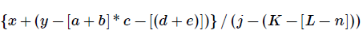
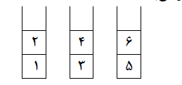
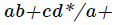

<style>
body {
    background-color: #e0d9c3ff;
}
</style>

<h2 style="color:#808000;">
exercise
</h2>

<h4 style="color:#000000;">

۱. یک پشته خالی با اعداد ۱ تا ۶ در ورودی داده شده است. اعمال زیر بر روی پشته قابل انجام هستند.
PUSH: کوچکترین عدد ورودی رو برداشته و وارد پشته می کنیم.
POP: عنصر بالای پشته را در خروجی نوشته و سپس آن را حذف می کنیم.
کدامیک از گزینه های زیر را نمی توان با هیچ ترتیبی از اعمال فوق بدست آورد؟( اعداد از چپ به راست)
<div dir="rtl">

```
 ۱ ۲ ۳ ۵ ۶ ۴ (1

 ۳ ۲ ۴ ۶ ۵ ۱ (2

 ۴ ۳ ۲ ۱ ۶ ۵ (3

 ۲ ۱ ۵ ۳ ۴ ۶ (4
```

۲. عبارت زیر را در نظر بگیرید. میخواهیم با استفاده از یک پشته بررسی کنیم که آیا پرانتز، کروشه و آکولادها بدرستی تطبیق می شود یا نه. پشته مورد استفاده حداقل بایستی گنجایش چند عنصر را داشته باشد؟


<div dir="rtl">

```
۱) ۴

۲) ۹

۳) ۱۸

۴) ۲۷
```

۳. سه پشته S1 و S2 و S3 هر یک حاوی دو عدد به شکل زیر می باشد:



دو عملگر poppush(i, j) و pop(i) به صورت زیر تعریف شده اند. Poppush(i, j) یک قلم از پشته Si حذف و به پشته Sj اضافه می کند. pop(i) یک قلم از پشته Si حذف و سپس آن را چاپ می کند. برای چاپ اعداد ۱ تا ۶ به صورت ۱ و ۳ و ۵ و ۲ و ۴ و ۶ عملگر poppush بایستی حداقل چند بار مورد استفاده قرار گیرد؟ اولین عددی که چاپ می شود عدد ۱ ، دومین عدد، عدد ۳ و … می باشد.
<div dir="rtl">

```
۱) ۳ بار

۲) ۵ بار

۳) ۶ بار

۴) ۴ بار
```

۴. کم هزینه ترین (از نظر تخصیص حافظه) راه برای اینکه ترتیب عناصر یک Stack را برعکس کنیم کدام است؟
<div dir="rtl">

```
۱) از طریق ۲ پشته اضافی

۲) از طریق یک صف اضافی 

۳) از طریق یک پشته اضافی و چند متغیر

۴) هیچکدام
```

۵. کم هزینه ترین ( از نظر تخصیص حافظه) راه برای اینکه عناصر یک پشته S1 را به پشته دیگر S2 بدون اینکه ترتیب عناصر تغییر یابد، انتقال دهیم کدام است؟
<div dir="rtl">

```
۱) از طریق یک متغیر

۲) از طریق یک پشته اضافی 

۳) از طریق دو پشته اضافی 

۴) از طریق چند متغیر
```
6.آنچه در زیر آمده است یک شبه کد اشتباه براي الگوریتمی است که باید متوازن بودن یا نبودن رشته اي از پرانتزها را تعیین کند:

```
declare a character stack
while (more input is available)
{
read a character
if (the character is '(')
then push it on the stack
else if (the character is a ')' and the stack is not empty)
then pop a character off the stack
else print "unbalanced" and exit
}
print "balanced"
```
کدامیک از رشته هاي نامتوازن زیر توسط الگوریتم فوق، متوازن در نظر گرفته می شوند؟

```
1) ((())

2) ()) (()

3) (())) ()

4) (() ()))
```

7.بر روی پشته Sاعمال زیر تعریف شده‌اند:

<div dir="rtl">
->
(S,X) push : 

درج x در بالای پشته  با هزینه o(1)
<div dir="rtl">
->(S,X) pop:

حذف عنصر بالای پشته با هزینه o(1)
<div dir="rtl">
->Multipop(S,k):
حذف k عنصر بالای پشته (با فرض اینکه k حداکثر برابر تعداد عناصر موجود s است.) با هزینه o(k)

اگر nعمل از اعمال فوق به ترتیب دلخواه بر روی پشته sکه در ابتدا تهی است انجام میشود مجموع هزینه این Nعمل در بدترین حالت چقدر است ؟

```
1) O(N logN)

2) O(N2)

3) O(NK)

4) O(N)
```
<div dir="rtl">

8. با استفاده از یک پشته و اعمال push , pop ,zو ترتیبی ورودی زیر (به ترتیب از چپ به راست )
A,B,C,D,E,F کدام یک از ترتیب های زیر در پشته ممکن است؟(رشد پشته را از چپ به راست فرض کنید.) 


```
1) BDF

2) BEC

3) DBF

4) EDCBA
```
9.معادل INFIX عبارت prefix رو به رو چیست؟

Prefix : /*A-B/*C-+DEFG-HI

```
1) A*B-C*D+E-F/G/H-I

2) ((D+E-F)*C/G-B)*A/H-I

3) A*(B-C*(D+E-F)/G)/(H-I)

4) A*(B/(((C*(D+E))-F)-G))/(H-I)
```
10.حاصل postfix عبارت روبه رو چیست ؟

6,2,3,+,-,3,8,2,/,+,*,2,^,3,+

```
1) 7

2) 25

3) 49 

4) 52
```
<div dir="rtl">
11.مینیمم تعداد متغیر های میانی در محاسبه عبارت جبری 



که به صورت postfix است برابر است با ....

```
1) 1

2) 2

3) 3

4) 4
```
 