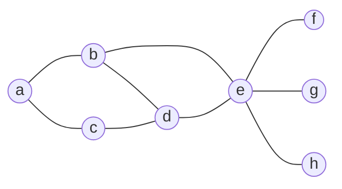
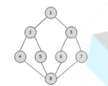
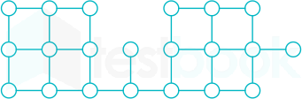
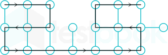
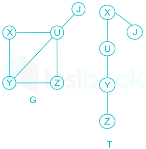

<div dir="rtl">
<br> 

## فهرست
- [گراف چیست؟](#گراف-چیست)
- [روش‌های نمایش گراف](#روشهای-نمایش-گراف)
- [الگوریتم‌های پیمایش گراف](#الگوریتمهای-پیمایش-گراف)
- [پیاده‌سازی کد](#پیادهسازی-کد)
- [سوالات تستی](#سوالات-تستی)

# گراف چیست؟ 

قبل از ورود به مبحث اصلی که یکی از الگوریتم‌های پیمایش در گراف‌ها است، بهتر که قبل از آن به طور سطحی مفهوم گراف را بیان کنیم.
گراف مجموعه‌ای از یال‌ها vertices و راس‌ها edges هست که بهم متصل هستند. گراف‌ها می‌توانند جهت‌دار و یا غیرجهت‌دار باشند. در گراف‌های جهت‌دار `<a, b>` به معنی اتصال از رأس a به b است. و در گراف‌های غیرجهت‌دار، {a, b} به معنی وجود یال بین دو رأس a و b است. گراف‌ها می‌توانند ویژگی‌های مختلفی مانند وجود یال از یک رأس به خودش `selfloop` باشند، اما ما در اینجا درباره گراف‌های ساده `simple` صحبت می‌کنیم که چنین ویژگی‌هایی برای آن‌ها مجاز نیست.
در گراف‌های ساده، درجه هر رأس، به معنی تعداد یال‌های متصل به آن رأس است. و یک گراف زمانی کامل است که درجه تمامی رئوس آن کامل باشد (همه رئوس به هم متصل باشند) در این صورت تعداد یال‌ها برابر $\frac{n(n-1)}{2}$ است.
### مسیر
در یک گراف زمانی که بتوان با پیمودن مجموعه‌ای از رئوس و یال‌های متصل به آن‌ها از یک رأس به یک رأس دیگر رسید، می‌گوییم بین آن دو رأس مسیر وجود دارد که آن را به صورت مجموعه‌ای از رئوس طی شده نشان می‌دهیم. طول مسیر برابر تعداد یال‌های است که طی می‌شوند.
### دور
زمانی که از یک راس به خودش مسیری وجود داشته باشد، می‌گوییم که آن گراف دارای دور است.

### همبندی connected
اگر در یک گراف ساده، بین دو رأس، حداقل یک مسیر وجود داشته باشد، می‌گوییم آن گراف همبند است. در غیر این صورت گراف یک گراف ناهمبند است.

---
برای بهتر متوجه شدن مطالب بالا، با یک مثال تمامی موارد رو به صورت زیر نشان می‌دهیم. در زیر، شما شکل دو گراف جهت‌دار G1 و G2 را می‌بینید. 


برای مثال، در این گراف، داریم:
رأس | A | B | C | D | E | F 
------| ---|---|----|----|----|----|---
درجه | ۳ | ۲|۳|۲|۴|۲|
و  $P_1 = \{A,E,C,B\}$ یک مسیر از رأس A به B است که طول آن ۳ است.

---

## روش‌های نمایش گراف
برای پیاده‌سازی گراف و نمایش آن، از روش‌های مختلفی می‌شود استفاده کرد که در ادامه به سه مورد اصلی‌تر می‌پردازیم.
### ۱. ماتریس مجاورتی
در این روش، با در نظر گرفتن اینکه گراف G دارای n رأس است، یک ماتریس $n\times n$ را در نظر می‌گیریم که اگر در آن، $i$ نمایان‌گر سطر‌ها باشد و $j$ نمایان‌گر ستون‌ها، اگر از رأس $i$ به $j$ یالی وصل باشد، درایه $a_{i\times j}$ را یک در نظر می‌گیریم و در غیراین صورت صفر. بدیهی است که اگر گراف غیرجهت‌دار باشد، متقارن است و می‌توان فقط با در نظر گرفتن مثلث بالا یا پایین، سوالات را حل کرد.

> نکته: پاسخ سوالات متداول، از قبیل اینکه چند یال دارد؟ یا اینکه همبند است یا نه؟ به حداقل زمان $O(n^2)$ نیاز دارد.
### ۲. لیست مجاورتی
در این روش ما به تعداد رئوس (در اینجا n) لیست پیوندی ایجاد می‌کنیم که نودهای آن رئوسی هستند که آن رأس به آن‌ها متصل است. و به این شکل گراف ذخیره‌سازی می‌شود. برای آسان‌تر کردن محاسبه یال‌های ورودی به یک رأس در یک گراف جهت‌دار بهتر است که لیست مجاورتی معکوس آن نیز محاسبه شود.

---
## الگوریتم‌های پیمایش گراف
اکنون که به‌طور مختصر راجب گراف‌ها صحبت کردیم، نوبت به اصل مطلب یعنی الگوریتم‌های پیمایش رسیده است. در الگوریتم‌های پیمایش، هدف این است که تمامی رئوس گراف مدنظر را ملاقات کنیم. هرکدام دقیقا یکبار. برای اینکار دو الگوریتم مشهور وجود دارد: ۱. پیمایش عمقی (Depth First Search)		۲. پیمایش سطحی (Breadth First Search) که در این بخش ما مورد اول یعنی پیمایش عمقی یا همان DFS را بررسی می‌کنیم.

### DFS
در این الگوریتم، ما یک رأس را انتخاب کرده، و آن را ملاقات می‌کنیم و سپس به سراغ یکی از رئوس همسایه آن رأس می‌رویم و همین کار را انجام می‌دهیم. این‌کار را تا زمانی انجام می‌دهیم که تمامی رئوس گراف مشاهده بشوند. و زمانی که به گره رسیدیم، یک مرحله به عقب برمی‌گردیم.
این الگوریتم، با استفاده از روش بازگشتی و پشته قابل پیاده‌سازی است.

به عنوان مثال به گراف زیر توجه کنید:

اگر بخواهیم با شروع از رأس a و با اولویت‌بندی رئوس به ترتیب حروف الفبا در این گراف پیمایش عمیق انجام بدیم به این صورت خواهد بود:

> در ابتدا خود رأس a را ملاقات می‌کنیم. سپس به سراغ همسایه‌های آن می‌رویم. که رئوس b و c هستند. که با توجه به اولویت ابتدا b را ملاقات می‌کنیم. سپس به سراغ همسایه‌های b می‌رویم. که رئوس a و d و e هستند. چون رأس a قبلا مشاهده شده پس رأس بعدی به ترتیب اولویت d است. سپس به سراغ همسایه‌های d می‌رویم که رئوس c و b و e هستند که در اینجا باید رأس c را انتخاب کنیم. اکنون بعد از رسیدن به c چون تمام همسایه‌های آن ملاقات شده‌اند، به گره رسیده‌ایم. پس یک مرحله به عقب برمی‌گردیم، یعنی رأس ‌d. پس حالا رأس انتخابی بعدی e است و به همین ترتیب f سپس g و سپس h.
> ترتیب ملاقات: a-b-d-c-e-f-g-h

نکته: اگر ترتیب ملاقات‌ها را رسم بکنیم، به یک درخت پوشا می‌رسیم که همان DFS است.


---
## پیاده‌سازی کد
گراف مثال بالا را در نظر بگیرید. در ادامه می‌خواهیم با پیاده‌سازی کد نمایش این گراف و همچنین پیمایش آن با الگوریتم پیمایش عمقی با زبان برنامه‌نویسی Python بپردازیم.
### نمایش گراف
برای نمایش گراف، از روش لیست مجاورتی استفاده می‌کنیم. به این شکل که در زبان برنامه‌نویسی Python، یک دیکشنری ایجاد کرده که در آن هر key یک رأس گراف است و value آن، یک لیست است که شامل تمامی رئوسی است که با آن رأس همسایه هستند.
```python
graph_G  =  {
"a":  ["b",  "c"],
"b":  ["a",  "d",  "e"],
"c":  ["a",  "d"],
"d":  ["b",  "c",  "e"],
"e":  ["b",  "d",  "f",  "g",  "h"],
"f":  ["e"],
"g":  ["e"],
"h":  ["e"]
}
```


### پیمایش عمقی
اکنون برای پیمایش این گراف به روش DFS کافی است که ابتدا یک لیست درست بکنیم به اسم visited که بعد از ملاقات هر رأس آن را داخل آن لیست قرار بدهیم تا بعدا دوباره آن را ملاقات نکنیم. و همانطور که بالاتر گفتیم، برای این الگوریتم از پشته استفاده می‌کنیم. که برای ایجاد پشته در زبان Python کافی است یک لیست ایجاد بکنیم و عملیات‌های push و pop را از انتهای آن انجام بدهیم.
در نهایت این عملیات را تا زمانی انجام می‌دهیم که پشته خالی بشود (تمامی رئوس ملاقات بشوند).
```python
# ایجاد پشته و لیست رئوس ملاقات شده

stack  =  []
visited  =  []

#اضافه کردن رأس شروع کننده به پشته
stack.append("a")
#پیمایش گراف تا زمانی که تمامی رئوس ملاقات بشوند
while  stack:
    last_edge  =  stack.pop()
    #اگر رأسی قبلا ملاقات شده، از آن عبور می‌کنیم
    if  last_edge  in  visited:
        continue
    else:
        #نمایش رأس ملاقات شده
        print(last_edge)
        #اضافه کردن رأس به لیست ملاقات شده‌ها
        visited.append(last_edge)
        #اضافه کردن همسایه‌های آن رأس به پشته
        for  neighbour  in  graph_G[last_edge:
            stack.append(neighbour)
```
و خروجی دقیقا همان چیزی است که به دست آوردیم.

## سوالات تستی
###### ۱) اگر در گراف زیر از رأس ۴ شروع به پیمایش بکنیم (با روش جست‌و‌جوی عمقی) کدام گزینه می‌تواند خروجی درست باشد؟

۱. ۴، ۸، ۵، ۲، ۱، ۳، ۶، ۷
۲. ۴، ۲، ۸، ۱، ۳، ۵، ۶، ۷
۳. ۴، ۸، ۷، ۶، ۳، ۵، ۲، ۱
۴. ۴، ۸، ۵، ۶، ۷، ۲، ۳، ۱
<details>
<summary>جواب</summary>
گزینه ۱

>در dfs ما یک شاخه را تا جایی که ادامه پیدا کند پیمایش می‌کنیم و سپس اگر به انتهای آن برسیم یا به رأس ملاقات شده، یک مرحله به عقب برمی‌گردیم. پس به همین صورت تنها گزینه ممکن گزینه یک است.
</details>

###### ۲) بک‌ترکینگ از تولید گره ---- ، ---- توابع مرزبندی استفاده می‌کند.
۱. اول سطح - با
۲. اول سطح - بدون
۳. اول عمق - با
۴. اول عمق - بدون
۵. هیچ‌کدام
<details>
<summary>جواب</summary>
گزینه ۳

> بک‌ترکینگ به معنای این است که ابتدا یک گره را کامل پیمایش بکنیم و بعد زمانی که دیگه گره‌ای باقی نماند، با برگشت به عقب بقیه گره‌ها را نیز پیمایش بکنیم. این دقیقا روشی است که الگوریتم اول عمق انجام می‌دهد.
</details>

###### ۳) الگوریتم جست‌و‌جو اول عمق، از ساختمان داده ---- برای اجرا و پیاده‌سازی استفاده می‌کند.
۱. پشته
۲. صف
۳. درخت
۴. بیشتر از یکی از موارد بالا
۵. هیچ‌کدام
<details>
<summary>جواب</summary>
گزینه ۱

> در الگوریتم جست‌و‌جو اول عمق، بعد از ملاقات یک گره، باید همسایه‌های آن پیمایش بشوند و این پروسه انقدر تکرار بشود که دیگر گره ملاقات شده نماند، سپس به عقب برگردد. این موضوع نیاز به اولویت بندی بر اساس FILO یعنی اولین ورودی اخرین خروجی دارد که ساختار پشته است.
</details>

###### ۴) گراف زیر و پیمایش‌های داده شده را در نظر بگیرید. کدام موارد از این پیمایش‌ها درست هستند؟

A. abcghf
B. abfchg
C. abfhgc
D. afghbc

1. A, B, D
2. A, B, C, D
3. B, C, D
4. A, C, D
<details>
<summary>جواب</summary>
گزینه ۴
</details>

###### ۵) اگر گراف G یک گراف با تعداد n رأس و m یال باشد، آنگاه برای یک پیمایش اول عمق با استفاده از ماتریس مجاورتی، تتای آن کدام است؟
1. n
2. n + m
3. $n^2$
4. $m^2$
<details>
<summary>جواب</summary>
گزینه ۳

> زمانی که یک گراف را با ماتریس مجاورتی نمایش می‌دهیم، یک ماتریس $n \times n$ داریم که باعث می‌شود تا پیمایش روی آن حداقل به مدت زمان $n^2$ ظول بکشد.
</details>

###### ۶) گراف G را یک گراف ساده غیر جهت‌دار در نظر بگیرید. اگر $T_D$ درخت پیمایش اول عمق و $T_B$ درخت پیمایش اول سطح این گراف باشد، با در نظر گرفتن دو جمله زیر گزینه درست را انتخاب کنید.
جمله ۱: هیچ یالی از G نسبت به $T_D$ ضربدری نیست.
جمله ۲: برای هر یال (u, v) G. اگر اختلاف عمق رأس u و v در $T_B$ برابر یک است.
۱. هر دو جمله درست هستند.
۲. هر دو جمله غلط هستند.
۳. جمله اول درست ولی دومی غلط است.
۴. جمله دوم درست ولی اولی غلط است.

<details>
<summary>جواب</summary>
گزینه ۳

> در گراف‌های غیرجهت‌دار، الگوریتم جست‌و‌جو اول عمق یال ضربدری ایجاد نمی‌کند. و در الگوریتم جست‌و‌جوی اول سطح نیز، یک یال می‌تواند بین دو رأس از یک سطح باشد. پس اختلاف می‌تواند صفر باشد.
</details>

###### ۷) فرض بکنید که یک جست‌و‌جوی اول عمق بازگشتی روی گراف زیر از یک رأس دلخواه پیاده‌سازی بکنیم. اگر تابع بازگشتی فقط زمانی فراخوانی بشود که یاد مورد نظر ملاقات نشده باشد، بیشترین مقداری که می‌توان این تابع را فراخوانی کرد چقدر است؟

<details>
<summary>جواب</summary>
۱۹

> 
</details>

###### ۸) نقطه انفصال، رأسی در یک گراف است که با حذف آن رأس و یال‌های متصل به آن، مقادیر همبندی گراف بیشتر بشود. اگر T درخت پیمایش جست‌و‌جوی اول عمق روی گراف همبند و غیرجهت‌دار G باشد، کدام گزینه درست است؟
۱. اگر u یک نقطه انفصال در گراف G باشد، به‌طوریکه x یک جد برای آن و y یک فرزند برای آن باشد، همه مسیر‌های ممکن از x به y از u می‌گذرد.
۲. ریشه درخت T یک نقطه انفصال است اگر و فقط اگر بیشتر از یک فرزند داشته باشد.
۳. ریشه درخت T هیچ‌گاه نمی‌تواند نقطه انفصال باشد.
۴. یک برگ از درخت T می‌تواند نقطه انفصال باشد.

<details>
<summary>جواب</summary>
گزینه ۲

> گزینه‌های ۳ و ۴ به صورت بدیهی غلط است. اما گزینه یک غلط است زیرا می‌توانیم گرافی داشته باشیم به صورت: 

</details>

###### ۹) در یک پیمایش با روش dfs،وقتی به یک رأس می‌رسیم، کدام‌یک اتفاق میوفتد؟
۱. به صف اضافه می‌شود.
۲. به عنوان ملاقات شده در نظر گرفته می‌شود و قبل از همسایه‌هایش بررسی می‌شود.
۳. بعد از تمامی گره‌های هم سطح خودش بررسی و ملاقات می‌شود.
۴. نادیده گرفته می‌شود.

<details>
<summary>جواب</summary>
گزینه ۲

> خود آن گره قبل از بقیه همسایه‌هایش بررسی و ملاقات می‌شود.
</details>

###### ۱۰) پیچیدگی زمانی یک الگوریتم dfs چقدر است اگر گراف با لیست مجاورتی پیاده‌سازی شده باشد؟ (v تعداد رأس‌ها و e تعداد یال‌ها است)
1. O(V+E)
2. O($V^2$)
3. O($E^2$)
4. O($log_{V}$)

<details>
<summary>جواب</summary>
گزینه ۱
</details>

###### ۱۱) در یک گراف جهت‌دار، از الگوریتم dfs برای کدام‌یک از موارد زیر استفاده می‌شود؟
۱. کوتاه‌ترین مسیر
۲. مینیمم درخت پوشا
۳. تعداد دور
۴. مرتب‌سازی توپولوژیک

<details>
<summary>جواب</summary>
گزینه ۳

> برای دو مورد اول از الگوریتم جست‌و‌جوی اول سطح bfsاستفاده می‌شود. همینطور از dfs برای مورد چهارم نیز استفاده می‌شود اما الگوریتم اصلی آن نیست.
</details>

###### ۱۲) در یک پیمایش با الگوریتم dfs شروع از یک گره ثابت همیشه خروجی ثابتی می‌دهد.
۱. درست
۲. نادرست

<details>
<summary>جواب</summary>
گزینه ۲

> بستگی به رأس‌های مجاور آن دارد.
</details>

###### ۱۳) کدام‌یک از مسائل زیر قابل حل با dfs هستند؟
۱. پیدا کردن اجزای متصل
۲. حل 2-SAT
۳. پیدا کردن نقاط انفصال
۴. همه موارد

<details>
<summary>جواب</summary>
گزینه ۴

> تمامی مسائل بالا قابل حل با الگوریتم dfs هستند.
</details>

---
## نویسندگان
- امیر بیگلری (مطالب)
- زهرا شعبانی (مطالب تکمیلی و کد)
- پارسا دباغ (سوالات تستی)
</div>